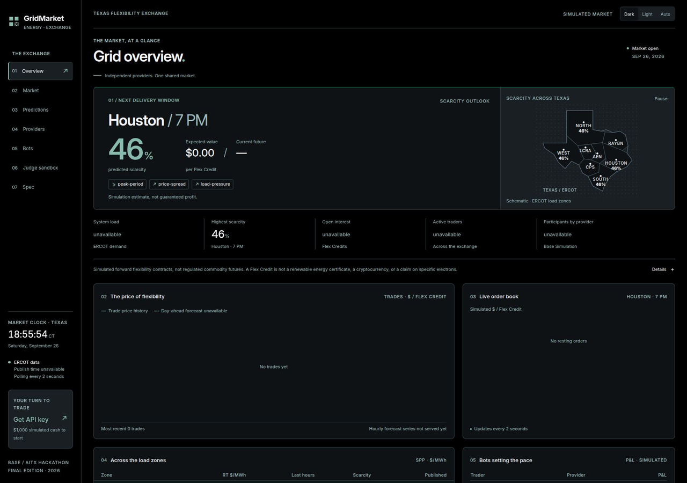
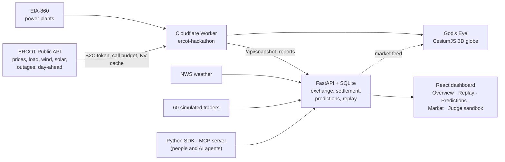

# GridMarket

**Texas home batteries, paid to help when the grid is tight.**

*A simulated flexibility exchange running on real ERCOT conditions.*

GridMarket explores how households could earn money by making spare battery
capacity available when Texas needs it. Watch grid conditions, inspect the
scarcity forecast, and place a simulated order for a Flex Credit: a contract
for battery flexibility in a particular place and delivery hour. People and
bots trade through the same API. All homes, batteries, procurement and money
are simulated; ERCOT and weather observations come from real public sources
when live data is configured.



## Try it in 3 minutes

Start the app below, then follow [Your first 3 minutes](docs/judges.md) to monitor conditions, replay a real day, and place a simulated trade.

1. **Monitor:** open [Overview](http://127.0.0.1:8000/#/) and inspect the
   Texas zones, data freshness and simulated exchange tape.
2. **Replay:** open [Replay](http://127.0.0.1:8000/#/replay) to simulate battery
   dispatch on real ERCOT conditions, inspect decisions, and test disruptions.
3. **Forecast:** open [Predictions](http://127.0.0.1:8000/#/predictions),
   choose a zone and read the drivers behind its score.
4. **Respond:** open [Judge sandbox](http://127.0.0.1:8000/#/sandbox), get a
   key and use the SDK example below to buy one Flex Credit.
5. **Report:** read your order status and portfolio; open
   [Market](http://127.0.0.1:8000/#/market) to inspect the book and fills.
   An accepted order can rest unfilled until a seller matches its price.

## Live links

- **Dashboard and market (live exchange, 60 bots, judge sandbox):** <https://came-grace-cycling-ala.trycloudflare.com>
- **API docs:** <https://came-grace-cycling-ala.trycloudflare.com/docs>
- **God's Eye, 3D Texas grid on live ERCOT data:** <https://ercot-hackathon.1wgrumph.workers.dev/godseye/>
- **The real day, one click:** <https://ercot-hackathon.1wgrumph.workers.dev/replay/#start> replays 26 Aug 2026 and stops on Houston's $780.46/MWh spike.
- The team Worker at <https://ercot-hackathon.1wgrumph.workers.dev> runs this repository's `main` branch (v1.0.0 Worker, God's Eye with the help-the-grid layer and past range, and the `/replay/` real-day tour added from Jordan Hill's replay page); only the replay page's help windows still read `/api/help` from the demo Worker at `ercot-hackathon.jordan-691.workers.dev`, whose source is on the [`jordaaan` branch](https://github.com/1wgrumph/gridmarket/tree/jordaaan/ercot-hackathon).
- **ERCOT data edge (Worker API):** <https://ercot-hackathon.1wgrumph.workers.dev/api/snapshot>

The market runs on the team's machine through a Cloudflare tunnel during judging; if it is unreachable, the 3-minute local run below gives the same product.

## Run it locally

### Docker Compose

Requirements: Docker with Compose 2.24 or later. Run from the repository root.
Copy the template, then set `GRIDMARKET_BOT_SECRET` to a locally generated
secret and `GRIDMARKET_DB=/data/gridmarket.db` before starting; use the same
secret for the app and bots. Do not leave either value blank. No ERCOT credentials are needed for the simulated exchange.

```sh
cp .env.example .env
# Edit .env: set GRIDMARKET_BOT_SECRET and GRIDMARKET_DB=/data/gridmarket.db.
docker compose --env-file .env -f deploy/compose.yaml up -d --build
curl --fail http://127.0.0.1:8000/v1/market/status
```

Expect `"status":"open"` with empty `anomalies` on a fresh database, plus
`open_interest` and `active_traders` counts. Open the
[dashboard](http://127.0.0.1:8000/) or [API docs](http://127.0.0.1:8000/docs)
(OpenAPI at `/openapi.json`).

- `app` serves the API and built dashboard; `bots` is the simulated-population
  service. Both run from one image, which includes the Python SDK the bot loop
  uses.
- Both use a non-root user (UID 10001), a read-only root filesystem and the
  project-scoped `gm-data` SQLite volume.
- HTTP binds to `127.0.0.1` only. `GRIDMARKET_PORT` defaults to 8000;
  `--env-file .env` makes the `GRIDMARKET_PORT` in `.env` effective; without
  it, set `GRIDMARKET_PORT` in the shell. Adjust browser and SDK URLs if you
  change it. Public access goes through an outbound Cloudflare named tunnel;
  no inbound port is opened.
- `GM_ENV_FILE` selects a service env file (default `../.env`, relative to
  `deploy/`). Keep it consistent with Compose's `--env-file` selection.

### Development without Docker

Requirements: Python 3.12+, uv, Node.js 22 and npm. Stop the Compose demo first
if using the same port. Build the dashboard before starting the backend so
both are served from one origin. Use the `.env` copied above, set
`GRIDMARKET_DB=./gridmarket.db`, and keep its generated `GRIDMARKET_BOT_SECRET`:

```sh
make setup
npm --prefix dashboard run build
uv run --project backend --frozen --env-file .env uvicorn gridmarket_server.main:app --host 127.0.0.1 --port 8000
```

In a second terminal at the repository root, load the same `.env`:

```sh
PYTHONPATH=sdk/python uv run --project backend --frozen --env-file .env python -m gridmarket_server.bots
```

Open <http://127.0.0.1:8000/>. Rebuild the dashboard after frontend edits;
restart the backend after Python edits. `GRIDMARKET_NWS=off` disables weather
requests for an offline demo.

## Live data

The backend polls a Cloudflare Worker for `/api/snapshot` and ERCOT reports:
real-time settlement prices, day-ahead prices, load forecasts, outages and
transmission constraints. Set `GRIDMARKET_WORKER_URL` to its origin and
`GRIDMARKET_WORKER_KEY` to the shared `MARKET_KEY` used for report access.
NWS forecasts and alerts are fetched directly, need no key, and are enabled
unless `GRIDMARKET_NWS=off`. Build the dashboard with
`VITE_GODSEYE_URL=<worker origin>/godseye/` to show its God's Eye link
(hidden when unset).

The Worker needs `ERCOT_USERNAME`, `ERCOT_PASSWORD`,
`ERCOT_SUBSCRIPTION_KEY` and `MARKET_KEY`; see the
[Worker setup](ercot-hackathon/README.md#setup) for its KV and wrangler deployment
steps. Set the Worker's `vars.MARKET_URL` to the public market origin and
`GRIDMARKET_CORS_ORIGIN` on the market to the Worker's origin. This connects
its grid views to market activity. Configuration changes require restarting
or redeploying the affected service.

Without ERCOT keys, the local exchange, bots, sandbox and API still work;
ERCOT observations are unavailable. NWS can still work with network access.
Missing or stale inputs are not live evidence: inspect freshness and forecast
drivers before interpreting scores. The screenshot above is a keyless local
demo, not a live ERCOT reading.

## Build a trading bot or agent

Discover endpoints in [OpenAPI](http://127.0.0.1:8000/docs), get a key in
[Judge sandbox](http://127.0.0.1:8000/#/sandbox), then make your first call.
A new account has $1,000 of simulated funds. Keep that page open to watch
**Your orders**, and enter its key when prompted below. The key stays in
memory and is not printed. Python 3.10+ is sufficient for the standard-library SDK.

Run from the repository root:

```sh
PYTHONPATH=sdk/python python3 - <<'PY'
from getpass import getpass
from gridmarket import Client

client = Client("http://127.0.0.1:8000", api_key=getpass("Sandbox key: "))
product = next(p for p in client.market()
               if p["status"] == "open" and p["symbol"].startswith("FLEX-"))
print("Product:", product["symbol"])
print("Order:", client.buy(product["id"], quantity=1, price_cents=10))
print("Orders:", client.orders())
print("Portfolio:", client.portfolio())
PY
```

This places a limit order at 10 simulated cents, not a guaranteed fill.
Every SDK order sends a fresh `Idempotency-Key`; use `place_order` with your
own stable key when retrying the same order. A non-2xx response raises
`GridMarketError` with `status`, `code` and `message`.

Continue with the [SDK snippets](docs/llm/sdk-snippets.md),
[strategy template](examples/strategy-template/README.md) or
[local stdio MCP server](mcp-server/README.md). MCP uses your sandbox key and
public REST API, including the same risk checks; there is no remote MCP server.
SDK methods include `market`, `predictions`, `account`, `portfolio`, `orders`,
`place_order`, `buy`, `sell` and `cancel_order` (alias `cancel`).

## How it works

- **Data edge:** the Worker authenticates to ERCOT and caches observations;
  the backend also reads NWS weather.
- **Exchange:** FastAPI and SQLite track products, orders, fills, battery
  capacity, account balances and settlement.
- **Participants:** simulated households and bots use provider adapters and
  the same REST order boundary as developers.
- **Experience:** the React dashboard, Python SDK and MCP server expose
  market conditions and caller-scoped orders and portfolios.

### Architecture



## What is real and what is simulated

| Real | Simulated |
| --- | --- |
| ERCOT observations, when the Worker is configured | Households, batteries and provider capacity |
| NWS forecasts and alerts, when reachable | Procurement, orders, money, payouts and P&L |
| API requests and the running matching engine | Flex Credit contracts and scarcity estimates |

Flex Credits are simulated contracts, not regulated instruments, renewable
energy certificates, cryptocurrency or claims on specific electrons. No real
money or energy changes hands. The demo makes no claim to change wholesale
prices or prevent blackouts. Zone scores are informational, not advice.

Router decisions labelled **baseline rules** use fixed repository rules.
The optional hosted probability integration is off by default and makes no
call unless explicitly enabled.

## What the data shows

GridMarket is built on one pattern in ERCOT's public data. Checking every 15-minute Houston hub price from 1 June to 26 September 2026:

| Day | Houston hub peak | Time (CT) |
| --- | --- | --- |
| 26 Aug | $780.46/MWh | 10:15 PM |
| 23 Aug | $562.40/MWh | 9:00 PM |
| 2 Sep | $452.68/MWh | 8:00 PM |
| 16 Sep | $407.54/MWh | 8:00 PM |
| 17 Aug | $351.81/MWh | 8:15 PM |

Every big spike landed between 8 and 11 PM, after sunset, not at peak demand. On 26 August demand peaked at 90.5 GW at 4:30 PM, while prices stayed low. The $780.46 spike came at 10:15 PM with demand at 73.5 GW: solar had fallen from 16.9 GW at 6–7 PM to nothing by 9 PM, wind was 7.7 GW, and ERCOT's dispatch price reached $914.50. Day-ahead had priced that hour at $98.54. The hours that need help are the evening net-load ramp, and that's when a home battery's stored midday solar is worth most. Sources: ERCOT NP6-905-CD, NP4-190-CD, NP6-235-CD, NP6-323-CD, NP4-732-CD, NP4-737-CD.

## Known limitations and next steps

**Limitations**

- Households, batteries, providers (Base Sim, LoneStar Storage), orders and money are simulated. Flex Credits are not a registered ERCOT product; settling them for real would need a Qualified Scheduling Entity or a provider acting as one.
- ERCOT's Public API rate-limits bursts and publishes some reports with delay (real-time prices every 5–15 minutes; bid and offer disclosures after 2 or 60 days). The Worker budgets and caches calls, and the app shows "unavailable" instead of guessing when data is missing.
- The scarcity score is a scaled blend of observed signals, not a calibrated probability, a blackout prediction or a profit guarantee.
- God's Eye shows live settlement-point prices for 155 of 934 ERCOT plants: those whose EIA-860 node designation, or ERCOT naming convention, matches an ERCOT settlement point. Weather-zone placement uses approximate zone centers.
- Scoring 26 August after the fact uses that day's actual load, wind and solar, not the forecasts available beforehand.

**Next steps**

- Calibrate the scarcity score against realised prices (Brier score and reliability tracking) and route decisions on calibrated probabilities.
- Connect a real provider API (for example, a battery fleet's dispatch interface) behind the existing provider adapter contract.
- Price Flex Credits from the full settlement-point history, and add congestion-aware zones.
- Work out the settlement path with a QSE partner, with human approval on any real order.

## Tests and quality gates

From the repository root:

| Command | Checks |
| --- | --- |
| `make lint` | Public-content boundary, Python lint and formatting |
| `make check-public` | Private markers in tracked files |
| `make test-all` | Backend, tools, MCP, dashboard and Worker tests when present |
| `make test-dash` | Dashboard tests and production build |
| `make smoke SMOKE_PROJECT=gm-demo-check SMOKE_PORT=18045` | Isolated Compose build, dashboard, loopback binding, storage and bot health |

The smoke target creates its own temporary configuration and removes its
own containers and volume afterward. Choose an unused project name and port.

## Operator actions

`GRIDMARKET_ADMIN_KEY` is optional for the demo and required for admin actions.
Admin routes require the bearer key and a loopback caller or a peer in
`GRIDMARKET_ADMIN_NETS` (Compose sets its bridge subnet, so host-port requests
reach admin routes); requests carrying `CF-Connecting-IP` are rejected. You can
also execute admin requests with
`docker compose --env-file .env -f deploy/compose.yaml exec -T app` and an HTTP
client inside that container targeting `http://127.0.0.1:8000`. Never expose
admin actions through the public tunnel.

## Public tunnel (operator only)

Tunnel creation and credentials belong to the operator. Follow
[the tunnel template](deploy/cloudflared.example.yml): create a named tunnel,
copy the template to `~/.cloudflared/config.yml`, and fill in its UUID and
hostname. The Compose `tunnel` profile runs `cloudflared` with
`GM_TUNNEL_UID` set to your user ID and mounts
`${GM_TUNNEL_DIR:-~/.cloudflared}` read-only. It forwards to `http://app:8000`;
no inbound public port is opened.

## Design

See the [design system](docs/design/DESIGN.md) and
[frontend design guide](skills/gridmarket-frontend-design/SKILL.md).
See the [changelog](CHANGELOG.md) for shipped changes.

## Team

| Name | Role | Contact |
| --- | --- | --- |
| William Rumph | Exchange backend, settlement, predictions, replay, trading bots, SDK and MCP, React dashboard | GitHub [@1wgrumph](https://github.com/1wgrumph) |
| Jordan Hill | ERCOT data Worker, God's Eye 3D globe, EIA-860 power-plant layer, 26 Aug replay and grid-data analysis | GitHub [@jhillbht](https://github.com/jhillbht) |

## License

MIT. See [LICENSE](LICENSE).
