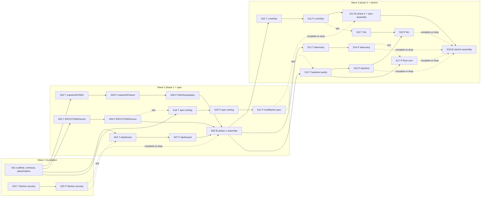

# GridMarket hackathon MVP — Design

The design realizes `gridmarket-technical-plan.md`. It is the smallest system
that shows every success criterion live. The architecture is hybrid
(DEC-GM-021): Jordan's Cloudflare Worker (`ercot-hackathon/`) is the ERCOT data
edge and the 3D views; the market reads ERCOT data only through it. Agent
lanes change the Worker only in the wave 1 security slices (DEC-GM-022). One Python
process owns the market,
one SQLite file owns the state, and everything else (bots, judges, dashboard)
goes through the same public HTTP API. System views (context, use cases,
operational flow) are owned by the Systems Modeler and live in `views/`
(`views/views.json` carries mode, trace, and digests).

## Design lenses

These lens names are the only values slices may cite in `design_lenses`.

| Lens | Question it answers |
|---|---|
| Market integrity | Can any order sequence break a ledger or capacity invariant? |
| Security controls | Are auth, idempotency, limits, and secrets enforced at the boundary? |
| Data ingestion | Does live ERCOT data arrive within the request budget and fail soft? |
| Explainability | Can a judge see why a score moved? |
| API contract | Do all clients (UI, bots, judges) use one documented surface? |
| Provider seam | Is capacity reached only through the adapter interface? |
| Operability | Does the stack start, restart, and expose itself only as intended? |
| Performance | Is a speed claim backed by a benchmark on one workload? |
| Integration | Does each merge keep the integrated branch demoable? |

## Repository layout (target)

```text
backend/                     Python 3.12, uv
  pyproject.toml  uv.lock
  gridmarket_server/
    contracts.py             shared types and protocols (wave 1, frozen)
    schema.sql               SQLite DDL (wave 1, frozen)
    main.py                  composition root, config, lifespan (wave 1, frozen)
    market.py                engine, risk, ledger, settlement
    api.py                   FastAPI routes, auth, idempotency, rate limits
    keys.py                  API key issue/revoke CLI
    seed.py                  seeded users and batteries
    providers/__init__.py    adapter registry
    providers/base_sim.py    Base simulator adapter
    providers/lonestar.py    LoneStar Storage adapter (phase 2)
    ercot.py                 ERCOT Worker client, budget, poller, parsers
    nws.py                   NWS hourly forecast and alerts client
    scoring.py               opportunity score
    bots.py                  seeded traffic through the SDK
    adversary.py             adversarial scenario (stretch)
    backtest.py              score backtest (stretch)
    ml.py  ml_data.py        ML model and its offline data fetchers (stretch)
  tests/                     pytest; fixtures/ercot/ holds test-only data
sdk/python/                  stdlib-only client, import name `gridmarket`
examples/python-trader/      judge example (<= 30 lines)
dashboard/                   React + Vite + Astryx, built to static files
rust/matching_core/          PyO3 engine (stretch)
tools/azdiagram/             figure generator (Spec lane)
tools/spec_build.py  tools/spec_lint.py  tools/tests/
spec/template/  spec/gridmarket/  skills/spec-*/   Spec lane
bench/                       matching benchmark (stretch)
deploy/                      Dockerfile, compose.yaml, cloudflared example
Makefile  .gitignore  .env.example  LICENSE  README.md
ercot-hackathon/             ERCOT Worker and 3D views (Jordan's lane, PR #3)
```

`gridmarket_server` is the backend package name so that the judge-facing SDK
can own the import name `gridmarket` (intent §13: `from gridmarket import
Client`).

## Decisions

### DES-GM-ARCH — Process and storage architecture

- One FastAPI/uvicorn process (`app`) serves the REST API, the built dashboard
  (static files mounted at `/`), and runs the ERCOT Worker poller and the
  settlement tick as lifespan background tasks. One process keeps the market's
  Worker request budget in one place; the ERCOT budget of 30 requests/minute
  and the ERCOT credentials live in the ERCOT Worker (DES-GM-EDGE).
- SQLite in WAL mode on a named Docker volume is the single system of record.
  Every state-changing request runs in one `BEGIN IMMEDIATE` transaction, so
  writers are serialized and capacity checks cannot race (Market integrity).
  `ponytail:` single-writer SQLite caps throughput at one write transaction at a
  time; move to per-product locks or Postgres only if the demo load needs it.
- Bots run in a second container (`bots`) and call the public API over HTTP
  (SC-9). The dashboard is a client of the same API (SC-11).
- Composition root `main.py` (wave 1) builds the app: it creates the DB,
  loads providers from the registry, selects the matching engine by
  `GRIDMARKET_ENGINE` (`python` default, `rust` only when importable and
  enabled), wires `scoring.predict` and the `ercot` signal store into the API
  dependencies, starts the ERCOT Worker poller only when
  `GRIDMARKET_WORKER_URL` is set, and starts the NWS poller unless
  `GRIDMARKET_NWS=off` (CMD-SMOKE sets it off).
  Lanes never edit `main.py`, `contracts.py`, `schema.sql`, `pyproject.toml`,
  `uv.lock`, `package.json`, or `api.ts` after wave 1. Wave 1 also writes
  placeholder modules (`market.py`, `api.py`, `ercot.py`, `nws.py`,
  `scoring.py`, `seed.py`, `providers/__init__.py`, `providers/base_sim.py`)
  that satisfy `contracts.py` with empty behavior (only
  `GET /v1/market/status`, empty registry, empty signal store, `predict`
  returns `[]`) so every lane imports `main.py`; owning lanes replace them.
  `main.py` mounts the dashboard only when the static directory exists.
  Dependencies for every lane are declared in wave 1: runtime, `dev`
  (pytest, pytest-cov, diff-cover, mutmut, ruff, PyYAML), and optional `ml`
  (numpy, scikit-learn), each admitted with a release at least 14 days old
  (DEC-GM-020).
- Lenses: Operability, Integration.

### DES-GM-MARKET — Order flow

Order submission (`POST /v1/orders`), in one transaction:

1. Authenticate the API key (hash lookup) → 401 on failure.
2. Rate limit per key (token bucket) → 429.
3. Idempotency: `(account_id, Idempotency-Key)` unique; identical body replays
   the stored response; different body → 409; missing key → 400.
4. Halt check: market or account halted → 423 `MARKET_HALTED` (stretch sets
   halts; phase 1 always open).
5. Risk (DES-GM-RISK) → 422 with typed reason.
6. Match with the selected `MatchingEngine` (CONTRACT-GM-ENGINE).
7. Apply fills to the ledger (DES-GM-SETTLE), append `trades` and `events`,
   store the idempotent response, commit.

Products: every hour the settlement tick lists, per zone, spot products for
the delivery hours 1–2 hours ahead and future products for 3–24 hours ahead
(AC-GM-MKT-01), and closes products whose delivery hour has started. The SDK
and API accept the alias `FLEX-<zone>-<HH>` for the next future product with
delivery hour `HH` (intent §13 example). Lenses: Market integrity, API
contract.

### DES-GM-RISK — Controls (never cut)

| Control | Rule | Requirement |
|---|---|---|
| Maximum order size | quantity 1..50 credits, integer | AC-GM-MKT-04 |
| Position limit | abs(net position per product after fill) ≤ 200 | AC-GM-MKT-04 |
| Cash holds | cash required by an order = limit price × quantity for every buy and for every future sell; spot sells need capacity instead of cash; available cash = cash − holds of the account's open orders; no margin or collateral model (intent §7) | AC-GM-MKT-04 |
| Capacity reservation | spot sell: per battery, reserve ≤ SoC − minimum reserve − existing reservations for the hour; reservation rows inserted in the same transaction via `ProviderAdapter.reserve_capacity` | AC-GM-MKT-03, AC-GM-PROV-01 |
| API keys | `Authorization: Bearer gm_<32 url-safe chars>`; stored as SHA-256; user and sandbox keys issued by `python -m gridmarket_server.keys issue [--sandbox] --name <label>` (owner-run); the single admin key is `GRIDMARKET_ADMIN_KEY` in the untracked `.env` | AC-GM-API-01, AC-GM-ADV-02 |
| Idempotency | as DES-GM-MARKET step 3 | AC-GM-API-02 |
| Rate limits | standard 20 req/s (burst 40), sandbox 5 req/s (burst 10), unauthenticated reads 10 req/s per client address (`CF-Connecting-IP` behind the tunnel, else socket peer) | AC-GM-API-03 |
| Append-only trade ledger | fills (`trades`), settlements, halts and lifts (`events`); SQLite triggers `RAISE(ABORT)` on UPDATE/DELETE of `trades` and `events` | AC-GM-MKT-02, AC-GM-ADV-02 |

`ponytail:` rate limiter is in-process memory; a restart resets buckets, which
is acceptable for one process. Lenses: Security controls, Market integrity.

### DES-GM-SETTLE — Ledger and settlement

- Spot fill (AC-GM-MKT-06): buyer cash −= price × qty and buyer Flex Credit
  inventory += qty; seller cash += price × qty; the seller's capacity
  reservation becomes a delivery commitment. When the
  delivery hour ends, the tick calls `verify_delivery`; the reservation is
  released and the commitment recorded as delivered, or as a default (buyer
  refunded) when the provider reports the asset offline.
- Future fill: position rows (signed quantity, average price); no cash moves
  at trade; the order's cash hold is released on fill or cancel.
- Future expiry (DEC-GM-008): when the four NP6-905-CD 15-minute RT SPP
  intervals of the delivery hour for the product's zone are stored, reference
  = mean ÷ 1000 $/credit (DEC-GM-008, no clamp); per position cash +=
  (reference − average price) × signed quantity; realized P&L recorded.
  `ponytail:` no margin model, so an extreme real-time price can drive a
  short position's cash below zero at settlement; the dashboard shows it; add
  a worst-case hold only if the owner asks.
- Unrealized P&L marks open future positions to the last trade price of the
  product, else the mid of best bid/ask, else the prediction's expected value.
- Lenses: Market integrity.

### DES-GM-ERCOT — ERCOT data through the ERCOT Worker (DEC-GM-021)

- `ercot.py` is an HTTP client of the ERCOT Worker (CONTRACT-GM-WORKER), not
  of ERCOT. It holds no ERCOT credentials; the Worker owns ERCOT auth, its
  55-minute token cache, and ERCOT's 30 requests/minute limit.
- Config from `.env` (git-ignored; `.env.example` lists names only):
  `GRIDMARKET_WORKER_URL`, `GRIDMARKET_WORKER_KEY` (the market client key,
  sent as `x-gridmarket-key` on report routes). The client never logs headers
  or the key (AC-GM-DATA-04).
- Storage keys (AC-GM-DATA-01): prices by settlement-point name, load
  forecast by ERCOT weather-zone name, outage capacity by load zone, shadow
  prices by constraint identity; every value with interval, source time, and
  fetch time.
- Routes (report paths confirmed 2026-09-25 from the Worker's ERCOT product
  catalog, `specialists/delta-f2-evidence.md`; field names are confirmed by one
  live call per route during phase 1 assembly, RISK-GM-09):

  | Signal | Worker route | Poll interval |
  |---|---|---|
  | System snapshot: demand, hub RT SPP, DAM HB_NORTH and DART, SCED lambda and headroom, wind and solar error, baseline checks (dashboard signals panel) | `/api/snapshot` | 5 min |
  | RT SPP, 15-min, load zones + `HB_HUBAVG` | `/api/report/np6-905-cd/spp_node_zone_hub` | 5 min |
  | DAM SPP, hourly, load zones | `/api/report/np4-190-cd/dam_stlmnt_pnt_prices` | 60 min (and on first start) |
  | Load forecast by weather zone | `/api/report/np3-565-cd/lf_by_model_weather_zone` | 60 min |
  | Hourly resource outage capacity by load zone | `/api/report/np3-233-cd/hourly_res_outage_cap` | 60 min |
  | SCED shadow prices and binding constraints | `/api/report/np6-86-cd/shdw_prices_bnd_trns_const` | 5 min |

- Budget: a sliding-window limiter allows at most 12 Worker requests per 60 s
  for the poller, including pagination; the client never sends `fresh`
  (AC-GM-DATA-02). The backtest and ML lanes (stretch) each use their own
  ≤ 5 requests/min budget, so market traffic stays under the Worker's
  30-per-minute client limit (AC-GM-EDGE-02); they never run while the demo
  is being recorded.
- Failure: 401, 404, 429, 5xx, or a connection that fails before a complete
  response (client timeout 20 s) → exponential backoff 5 s doubling to 300 s;
  stored values are served with `stale: true` and `age_s` (AC-GM-DATA-03).
- Weather-zone to load-zone mapping for load forecast: Coast→LZ_HOUSTON;
  North, North Central, East→LZ_NORTH; South Central, Southern→LZ_SOUTH;
  West, Far West→LZ_WEST (sum of MW). `ponytail:` fixed approximate mapping;
  replace with study-area forecasts if judges question it.
- Fixtures: `backend/tests/fixtures/ercot/` holds test-only JSON shaped like the
  Worker responses (snapshot shape of `snapshot.js` at `bae0a16`; report routes
  pass ERCOT `{fields, data, _meta}` through); only tests load them
  (DEC-GM-014). The live data path
  has no fixture loader.
- Lenses: Data ingestion, Security controls.

### DES-GM-EDGE — ERCOT Worker security fix (agent lane `worker`, DEC-GM-021, DEC-GM-022)

- Jordan owns the ERCOT Worker, its secrets, and its deployment. The fix is
  the first-wave agent slice pair S24–S25 (DEC-GM-022) on branch
  `gridmarket/lane-worker` from `origin/jordaaan` at `4853e51`; it changes
  only `ercot-hackathon/src/index.js`, `ercot-hackathon/wrangler.jsonc`,
  `ercot-hackathon/README.md`, and `ercot-hackathon/test/`. Deploying and
  setting secrets (`wrangler secret put MARKET_KEY`, `wrangler deploy`) are
  Jordan's actions.
- `ercot-hackathon/src/index.js`: a `REPORTS` set holds the report allowlist
  (exactly the five reports of DES-GM-ERCOT; the views call no report route); a
  `/api/report/*` path outside it returns 404 before any ERCOT call.
  `/api/report/*`, `/api/products`, and `/api/snapshot?fresh` require header
  `x-gridmarket-key` equal to secret `MARKET_KEY`, else 401 (AC-GM-EDGE-01).
  The views call only `/api/snapshot`, `/api/edc`, and `/api/health`, so they
  are unaffected. `/api/edc` forwards only the query parameters the `/` view
  sends, so callers cannot vary the cache key freely.
- Per-client limit: rate-limiting binding `RATE_LIMITER` (`ratelimits` in
  `wrangler.jsonc`, 30 per 60 s) keyed by `cf-connecting-ip` (one bucket per
  client address), returns 429 on `/api/*` before any ERCOT
  call (AC-GM-EDGE-02).
- Upstream budget: one guard in the shared ERCOT fetch path (token request,
  `ercotGet`, `ercotJSON`, retries included) takes one unit from binding
  `ERCOT_BUDGET` (25 per 60 s, constant key `ercot`) before every ERCOT call;
  when it is empty the route answers from cache or returns 429
  (AC-GM-EDGE-03). Concurrent `/api/snapshot` cache misses share one build
  promise per isolate. `ponytail:` rate-limiting bindings count per
  Cloudflare location and eventually; use a Durable Object counter only if
  the burst test or live logs show ERCOT 429s.
- 429 backoff: `ercotJSON` keeps its retry loop (at most 4 retries,
  wait min(4 s, `Retry-After`) when that header is positive, else
  min(4 s, 0.9 s × attempt)) (AC-GM-EDGE-04).
- Test: `node --test ercot-hackathon/test/` imports the Worker's default
  export with a stub `env` (in-memory `CACHE`, sliding-window stubs for
  `RATE_LIMITER` and `ERCOT_BUDGET`, secrets) and a stub `globalThis.fetch`
  that counts ERCOT calls; no new dependency. The burst case sends 40
  requests from each of 10 client addresses within one stub minute across
  `/api/snapshot`, `/api/edc`, and keyless `/api/report/*` on an empty cache
  and passes when ERCOT calls stay at or below 25 and every over-limit client
  gets 429 (DEC-GM-022 verification).
- Delivery: the lane pushes `gridmarket/lane-worker` and opens a PR into
  `jordaaan` (PR #3's head); S09 also merges the lane into
  `gridmarket/integration`.
- Jev (AC-GM-RULE-02): the views keep the label "baseline rules · Jev
  gateway pending" and call no Jev engine unless the owner records that it
  complies with DEC-GM-020.
- Lenses: Security controls, Data ingestion.

### DES-GM-NWS — NWS weather signals (phase 1, DEC-GM-017)

- `nws.py`: keyless client for `api.weather.gov` with header
  `User-Agent: gridmarket-hackathon (github.com/1wgrumph/gridmarket)`.
  `GET /points/{lat},{lon}` once per representative point (cached) gives the
  `forecastHourly` URL; hourly forecast polled every 60 min per zone; active
  alerts polled every 5 min per zone with `/alerts/active?point={lat},{lon}`,
  counting alerts with severity Severe or Extreme.
- Budget ≤ 6 requests per rolling 60 s; retry and stale rule as DES-GM-ERCOT
  (AC-GM-DATA-05). Stored in the same signal store (report ids `NWS-TEMP`,
  `NWS-ALERTS`), keyed by zone with fetch time and NWS update time.
- Written fresh during the hackathon; the private alphazede-sports fetcher is
  not ported (DEC-GM-020).
- Lenses: Data ingestion.

### DES-GM-SCORE — Explainable opportunity score

For zone `z` and future delivery hour `h`, each factor is squashed to
[−1, 1] with `tanh(x / scale)`:

| Factor | Raw input `x` | Scale |
|---|---|---|
| Price spread | DA SPP(z,h) − mean RT SPP(z) over the last hour, $/MWh | 50 |
| Load pressure | load forecast(z,h) − mean load forecast(z) over the next 24 h, MW | 0.1 × mean |
| Outage pressure | outage capacity(z,h) − median outage capacity(z) over the next 168 h, MW | 0.1 × median + 100 |
| Congestion pressure | (RT SPP(z) − RT SPP(HB_HUBAVG)) + 0.1 × sum of current binding-constraint shadow prices (every constraint in the sum is cited in the zone's explanation), $/MWh | 25 |
| Heat stress | max(NWS temperature(z,h) − 85, 0), °F | 10 |
| Peak period | +1 for an on-peak hour, −1 otherwise (stdlib calendar, NERC holidays computed, no dependency) | 1 (not squashed) |
| Weather alerts | count of active Severe or Extreme NWS alerts at z's representative point | 1 |

- Score = 50 + 50 × Σ wᵢ fᵢ with weights 0.18 for each of the four ERCOT
  factors, 0.12 heat stress, 0.08 peak period, 0.08 weather alerts (sum 1.0),
  clamped to 0..100;
  contribution of factor i = 50 × wᵢ × fᵢ points, each with a one-line
  explanation (for example "Outage capacity 2,310 MW vs 1,640 MW median").
- Monotonic by construction: `tanh` is increasing and weights are positive, so
  more outage capacity for the zone, or a higher shadow price cited in the
  zone's congestion explanation, never lowers the score (AC-GM-SCORE-02);
  the same holds for temperature above 85 °F and for the alert count
  (AC-GM-SCORE-05).
- Level: LOW < 40 ≤ MEDIUM < 70 ≤ HIGH.
- Confidence = freshness × agreement, where agreement = share of factors whose
  sign matches the sign of the total, and freshness = 1.0 when every input is
  younger than twice its poll interval, else 0.6.
- Expected value ($/credit) = max(DA SPP(z,h), 0) ÷ 1000 × (1 + 0.5 × (score −
  50) ÷ 50). Market price = last trade, else mid, else none.
- Every prediction carries `disclaimer: "Simulation estimate, not guaranteed
  profit."` (AC-GM-SCORE-03).
- Weights and scales are named constants in `scoring.py` (calibration knobs).
- Lenses: Explainability.

### DES-GM-UI — Dashboard

- One page, no login, Astryx components and tokens (via the
  `astryx-frontend-design` skill). Panels: ERCOT signals (value, ERCOT publish
  time, stale badge), predictions per zone (score, level, confidence,
  expected value vs market, factor contributions as signed bars), markets
  (product list, book depth, recent trades), participants per provider, market
  status and anomalies (empty list in phase 1), activity feed (orders
  including rejections with reason, labeled by account display name so a
  judge's key label is visible).
- Polling every 2 s through `dashboard/src/api.ts`, the typed client of
  CONTRACT-GM-API; no WebSockets (P2 excluded).
- Disclosures banner: the two statements of AC-GM-UI-02 plus the score
  disclaimer.
- Tests (vitest + Testing Library, jsdom) render the page from fixture API
  responses in `dashboard/src/test-fixtures.json`.
- Lenses: API contract, Explainability.

### DES-GM-SDK — SDK, example, bots

- `sdk/python/gridmarket/__init__.py`: stdlib `urllib` client `Client(api_key,
  base_url)` with `market`, `predictions`, `portfolio`, `buy`, `sell`,
  `cancel`, `orders`; each order call sends a fresh `uuid4` Idempotency-Key.
  No third-party dependency, so judges need only Python 3.
- `examples/python-trader/trade.py` (≤ 30 lines): reads `GRIDMARKET_API_KEY`
  and `GRIDMARKET_URL`, prints a prediction, buys 2 credits of
  `FLEX-LZ_HOUSTON-18`.
- `bots.py`: two strategies over seeded accounts' own keys — a market maker
  quoting around the prediction's expected value, and a score follower that
  buys futures when level is HIGH and expected value exceeds market price by
  20% with confidence > 0.75 (intent §12). Target ≥ 10 orders/min from ≥ 3
  accounts (AC-GM-BOT-01).
- Lenses: API contract.

### DES-GM-OPS — Hosting and isolation

- `deploy/Dockerfile`: multi-stage; Node stage builds the dashboard; Python
  3.12-slim stage installs the backend with uv and copies the static build;
  runs as uid 10001; `HEALTHCHECK` on `/v1/market/status`.
- `deploy/compose.yaml`: services `app` (ports
  `127.0.0.1:${GRIDMARKET_PORT:-8000}:8000`, `read_only: true`, tmpfs `/tmp`,
  project-scoped named volume `gm-data` for SQLite, `env_file` entry
  `{path: ${GM_ENV_FILE:-../.env}, required: false}` (CMD-SMOKE sets
  `GM_ENV_FILE=/dev/null`, TE-F3), `restart: unless-stopped`; no fixed
  `image:`, `container_name:`, or volume `name:`), `bots` (same image, command
  `python -m gridmarket_server.bots`), and `cloudflared` (profile `tunnel`,
  `cloudflared tunnel run` with the owner's named-tunnel credentials mounted
  read-only from outside the repository).
- Isolation mechanism for DEC-GM-009: containers (not a VM) — non-root,
  read-only root filesystem, no host mounts except the owner's tunnel
  credential file, no inbound public port.
- Tunnel creation, credential files, and `docker compose --profile tunnel up`
  are owner actions (credential access). The tunnel is live from the Sunday
  recording through 15:00 CDT, then stopped.
- Lenses: Operability, Security controls.

### DES-GM-PROV — Provider adapters

- `ProviderAdapter` (CONTRACT-GM-PROVIDER) is the only path from the market to
  batteries. The registry in `providers/__init__.py` lists enabled adapters.
- `base_sim` (phase 1): Base-like fleet, 13.5 kWh batteries, reserve 20%,
  5 kW limits, zones spread across all four load zones.
- `lonestar` (phase 2): "LoneStar Storage", a simulated second provider
  company: 10 kWh and 20 kWh batteries, reserve 30%, different customer
  naming, seeded with ≥ 20 customers; it also reports one asset offline to
  show provider health. Seeding extends `seed.py`.
- Lenses: Provider seam.

### DES-GM-ADV — Adversarial scenario and kill switch (stretch)

- `python -m gridmarket_server.adversary` drives three attacks through the
  public API: over-capacity spot sell (rejected, no balance change), an
  identical request reusing an Idempotency-Key (no second order), and a burst
  of 50 orders in 1 s from one standard-key account (exceeds the 20 req/s
  limit, so HTTP 429 and no state change) (AC-GM-ADV-01).
- Detection writes `anomalies` rows (kind, account, detail) exposed at
  `GET /v1/market/status`, which the dashboard already renders.
- Kill switch: `POST /v1/admin/halt` and `/v1/admin/resume` authenticated by
  `GRIDMARKET_ADMIN_KEY`, scope `market` or `account:<id>`; halt and lift
  appended to the append-only trade ledger (`events`) (AC-GM-ADV-02).
- Lenses: Security controls, Market integrity.

### DES-GM-BT — Score backtest (stretch)

- `python -m gridmarket_server.backtest --days 7` fetches NP4-190-CD,
  NP6-905-CD, NP3-565-CD, NP3-233-CD, NP6-86-CD history through the ERCOT
  Worker's allowlisted report routes (own ≤ 5 requests/min budget), recomputes `scoring.score` per
  zone-hour, and reports Spearman rank correlation against realized hourly RT
  SPP with n and date range as JSON and text. Stores computed metrics only,
  never raw responses (DEC-GM-007).
- Lenses: Explainability, Data ingestion.

### DES-GM-RUST — Rust PyO3 matching core (stretch)

- `rust/matching_core` (PyO3, built with maturin run through `uvx`) exports
  `match_order(book, incoming)` with the exact CONTRACT-GM-ENGINE semantics.
- The shared parity suite runs every matching case against both engines; the
  benchmark replays one seeded workload of 100,000 orders through each engine
  and records orders/second. `GRIDMARKET_ENGINE=rust` is set in compose only if
  the benchmark shows higher throughput (AC-GM-PERF-01).
- Lenses: Performance, Market integrity.

### DES-GM-ML — ML model versus deterministic score (stretch, DEC-GM-017)

- `ml_data.py` fetches, offline and never in the live data path: ERCOT
  archive history through the ERCOT Worker's allowlisted report routes (own
  ≤ 5 requests/min budget),
  Open-Meteo archive hourly temperature per representative point, Census
  county population estimates CSV, and LEHD LODES8 Texas WAC and RAC files
  (2022, `.../LODES8/tx/{wac,rac}/tx_{wac,rac}_S000_JT00_2022.csv.gz`).
  WAC minus RAC jobs per county gives a daytime population weight, summed to
  load zones with a fixed county-to-zone table (`ponytail:` approximate
  mapping via ERCOT weather zones; refine only if judges ask).
- `ml.py`: scikit-learn `HistGradientBoostingRegressor` on hour-of-day,
  peak flag, temperature, the four ERCOT factors' raw inputs, and the zone
  population weight; trained on ≥ 28 days, tested on the following ≥ 7 days;
  permutation importances. `python -m gridmarket_server.ml --train-days 28
  --test-days 7` reuses the backtest harness to report both Spearman values
  and writes `docs/ml-report.md`. No model is served by the API.
- First step of the lane: confirm Open-Meteo free-tier terms allow this
  non-commercial hackathon use with CC BY 4.0 attribution in the README; if
  not, drop the Open-Meteo feature (RISK-GM-10).
- Lenses: Explainability, Data ingestion.

### DES-GM-SPEC — Spec template, azdiagram, spec skills, GridMarket spec (DEC-GM-019)

- Format: Markdown with SVG figures, so judges read it on GitHub; the
  structure follows DEC-SPEC-004 (outline), DEC-SPEC-005 (BLUF, Frame, prose,
  one table or figure when the trigger fires, ≤ 5 requirements per section),
  and DEC-SPEC-006 (T1–T8, F1–F8).
- `tools/spec_build.py` generates the front matter (title block, revision
  history, TOC, list of tables, list of figures) and Appendix A traceability
  from `spec/gridmarket/*.md` into `spec/GridMarket-Specification.md`.
- `tools/azdiagram/`: per-class YAML input → Graphviz (`dot -Tjson`, installed
  2.42.2) layout for F1–F4, F6, F7 → SVG plus `.drawio` XML from the same
  coordinates; a pure-Python grid renderer for F5 (sequence) and F8 (timing);
  lint for box overlap and size limits (AC-GM-SPEC-01). No SysON source in
  this lane (no `maps-to-sysml` clauses).
- `tools/spec_lint.py` enforces AC-GM-SPEC-02; skills
  `skills/spec-author`, `skills/spec-diagram`, `skills/spec-lint` each state
  their command and pass rule.
- The GridMarket specification is written from `design.md` and the technical
  plan; it is a product deliverable, not a Bearing planning artifact.
- Lenses: Explainability, Integration.

### DES-GM-LANES — Workstreams, worktrees, and assembly

- One Lifecycle, one checkout lease, Coordinator-dispatched waves with 2–3
  concurrent lanes (DEC-GM-006 resolved: Coordinator waves, not separate
  Lifecycles).
- Integration branch `gridmarket/integration` in worktree
  `/home/spectre/alphazede/worktrees/base-gridmarket-integration`, created from
  the approved planning revision. Each lane has branch
  `gridmarket/lane-<name>` in worktree
  `/home/spectre/alphazede/worktrees/base-gridmarket-<name>`; wave 2 lanes
  are created from the S01 exit commit and wave 3 lanes from the S09 exit
  commit of the integration branch (`lane-rust` from the S15 exit, `lane-ml`
  from the S16 exit). Lane names: `foundation`, `market`, `data`, `ui`,
  `spec`, `worker`, `lonestar`, `adversary`, `stretch`, `rust`, `ml`.
- Worker lane (DEC-GM-021, DEC-GM-022): Jordan's branch `jordaaan` lands on
  `main` through PR #3. In wave 1, lane `worker` branches
  `gridmarket/lane-worker` from `origin/jordaaan` (`4853e51`), runs S24–S25,
  and opens a PR into `jordaaan`; S09 merges the lane into the integration
  branch after `ui`. Paths under `ercot-hackathon/` are disjoint from every
  other lane. Before the final candidate the Integration Engineer
  merges `origin/main` (with PR #3) into the integration branch.
- Concurrency cap 3 lanes, counted across waves: slot edges (scheduling
  order, not data) run `ui` after `worker`, `spec` after `data`, `stretch`
  after `spec`, `ml` after
  `lonestar` and `rust` after `adversary` in wave 3.
- Test Implementer and Product Implementer slices of one lane run in the same
  lane worktree in order (TDD); the lane branch merges only when green.
- The Integration Engineer (execution route) merges lanes with `--no-ff` in a
  fixed order and runs post-step V&V after every merge; a red step is reverted
  (RISK-GM-05). Merge conflicts beyond whitespace return to the lane.
- Remote `origin` = `github.com/1wgrumph/gridmarket` (private, DEC-GM-018).
  Lane and integration branches are pushed without force; `main` changes only
  through PRs (convention until the owner applies the ruleset after the public
  flip). The integration branch is the demo and freeze candidate.
- Lenses: Integration.

## Contracts

### CONTRACT-GM-API — REST surface

Public reads (no key, IP rate limit): `GET /v1/market`, `/v1/market/{symbol}`,
`/v1/market/history`, `/v1/market/activity`, `/v1/market/status`,
`/v1/predictions`, `/v1/predictions/{zone}`, `/v1/signals`, `/v1/providers`.
Keyed: `GET /v1/account`, `/v1/portfolio`, `/v1/positions`, `/v1/trades`,
`/v1/assets`, `/v1/assets/{id}`, `POST /v1/orders`, `GET /v1/orders`,
`/v1/orders/{id}`, `DELETE /v1/orders/{id}`. Admin (stretch):
`POST /v1/admin/halt`, `/v1/admin/resume`. OpenAPI at `/openapi.json`.
Errors: `{"error": {"code": "<UPPER_SNAKE>", "message": "..."}}` with codes
`UNAUTHENTICATED`, `RATE_LIMITED`, `IDEMPOTENCY_KEY_REQUIRED`,
`IDEMPOTENCY_CONFLICT`, `MARKET_HALTED`, `ORDER_TOO_LARGE`,
`POSITION_LIMIT`, `INSUFFICIENT_FUNDS`, `INSUFFICIENT_CAPACITY`,
`UNKNOWN_PRODUCT`, `PRODUCT_CLOSED`.

### CONTRACT-GM-ENGINE — Matching engine

`MatchingEngine.match(resting: list[RestingOrder], incoming: Order) ->
MatchResult(fills: list[Fill], remaining_qty: int)`; pure function; resting
orders sorted best price then earliest sequence; fill price = resting price;
no self-matching is not required in phase 1. Python and Rust engines satisfy
the same parity suite.

### CONTRACT-GM-PROVIDER — Provider adapter

`ProviderAdapter` protocol: `provider_id`, `display_name`,
`list_customers()`, `list_assets()`, `available_capacity(asset_id, hour)`,
`reserve_capacity(tx, asset_id, hour, kwh)`, `release_capacity(tx,
reservation_id)`, `verify_delivery(reservation_id) -> bool`,
`asset_status(asset_id) -> {"online": bool, ...}`. `tx` is the caller's open
SQLite transaction so reservation stays atomic with the order.

### CONTRACT-GM-SIGNALS — Signal store

`Signal(report_id, zone, interval_start, interval_minutes, value, unit,
published_at, fetched_at)`; `SignalStore.latest(report_id, zone)`,
`series(report_id, zone, start, end)`, `staleness(report_id) -> age_s`.

### CONTRACT-GM-WORKER — ERCOT Worker interface (DEC-GM-021)

Base URL `GRIDMARKET_WORKER_URL` (live: `https://ercot-hackathon.jordan-691.workers.dev`).
`GET /api/snapshot` returns the JSON built by `ercot-hackathon/src/snapshot.js`
at `bae0a16` (unchanged at `4853e51`): `asOf`, `ct`, `heNow`, `errors`, `demand`, `hubs`, `dam`,
`sced`, `wind`, `solar`, `weather`, `checks`; cached 5 min.
`GET /api/report/<emil-id>/<report>?<ERCOT query>` with header
`x-gridmarket-key` returns ERCOT's `{fields, data, _meta}` unchanged; the
report allowlist contains exactly the five reports of DES-GM-ERCOT:
`/api/report/np6-905-cd/spp_node_zone_hub`, `/api/report/np4-190-cd/dam_stlmnt_pnt_prices`, `/api/report/np3-565-cd/lf_by_model_weather_zone`, `/api/report/np3-233-cd/hourly_res_outage_cap`, `/api/report/np6-86-cd/shdw_prices_bnd_trns_const`.
Errors: 401 missing or wrong key, 404 report not allowlisted, 429 rate
limited (per client or ERCOT upstream budget), 502 ERCOT failure, 503 Worker
secrets missing. The market allows
cross-origin GET from `GRIDMARKET_CORS_ORIGIN` (the Worker origin) on its
six market and prediction reads named in AC-GM-API-05 only, so Jordan's views can show market activity.

### CONTRACT-GM-PREDICTION — Prediction record

`Prediction(zone, delivery_hour, score, level, confidence, expected_value,
market_price, drivers: list[{factor, contribution, detail}], disclaimer,
generated_at)`.

### CONTRACT-GM-SCHEMA — SQLite schema

Tables: `accounts`, `api_keys`, `providers`, `assets`, `products`, `orders`,
`trades`, `positions`, `reservations`, `idempotency`, `events`, `anomalies`,
`halts`, `signals`, `settlements`. Triggers enforce append-only `trades` and
`events`. Frozen in wave 1; a later schema change is a planning delta.

## Diagrams

System views (Systems Modeler): `views/v1-context.mmd`,
`views/v2-use-cases.mmd`, `views/v3-operational-flow.mmd`, with SVG renders
embedded in the DoD Manifest.

Implementation lanes and assembly order:


