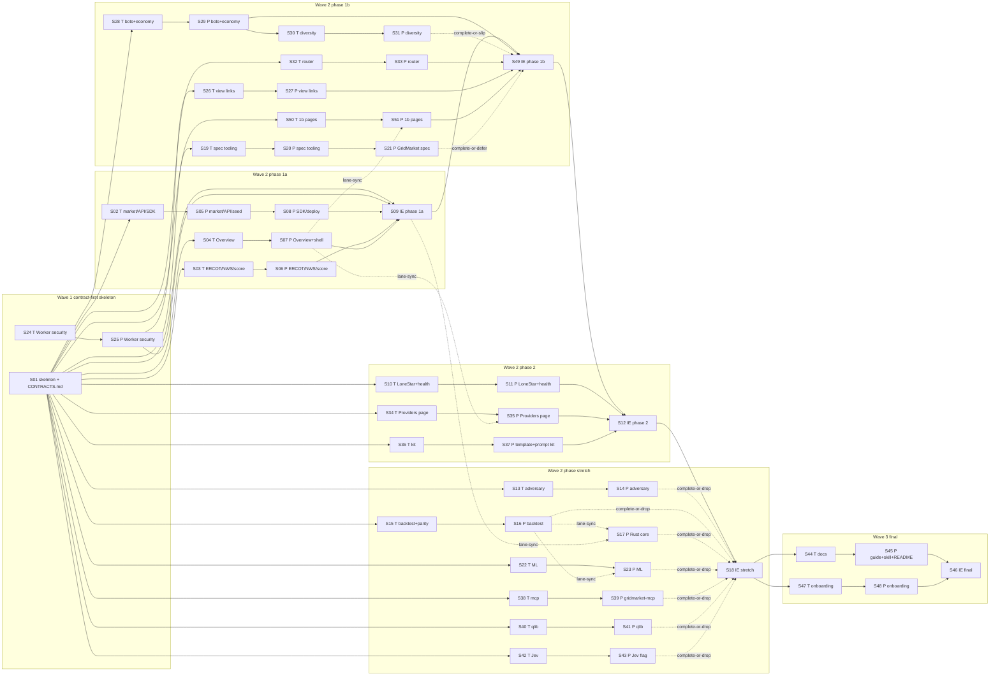

# GridMarket hackathon MVP — Design

The design realizes `gridmarket-technical-plan.md`. It is the smallest system
that shows every success criterion live. The architecture is hybrid
(DEC-GM-021, DEC-GM-027): the owner's Cloudflare Worker, built from Jordan's
`ercot-hackathon/` code, is the ERCOT data edge and serves the 3D views; the
market reads ERCOT data only through it. Agent lanes change the Worker only
in the worker and views lanes (S24–S27). The build is contract-first
(DEC-GM-039): wave 1 freezes every shared name in `CONTRACTS.md` and code
stubs, and every later lane builds against them in parallel. One Python
process owns the market,
one SQLite file owns the state, and everything else (bots, judges, dashboard)
goes through the same public HTTP API. System views (context, use cases,
operational flow) are owned by the Systems Modeler and live in `views/`
(`views/views.json` carries mode, trace, and digests).

## Design lenses

These lens names are the only values slices may cite in `design_lenses`.

| Lens | Question it answers |
|---|---|
| Market integrity | Can any order sequence break a ledger or capacity invariant? |
| Security controls | Are auth, idempotency, limits, and secrets enforced at the boundary? |
| Data ingestion | Does live ERCOT data arrive within the request budget and fail soft? |
| Explainability | Can a judge see why a score moved? |
| API contract | Do all clients (UI, bots, judges) use one documented surface? |
| Provider seam | Is capacity reached only through the adapter interface? |
| Operability | Does the stack start, restart, and expose itself only as intended? |
| Performance | Is a speed claim backed by a benchmark on one workload? |
| Integration | Does each merge keep the integrated branch demoable? |
| Agent population | Do bots trade diversely and reproducibly, only through the public API and risk engine? |
| Onboarding | Can a new person or agent go from zero to a live order quickly and safely? |

## Repository layout (target)

```text
CONTRACTS.md                 frozen shared names and amendments (wave 1, DEC-GM-039)
backend/                     Python 3.12, uv
  pyproject.toml  uv.lock
  gridmarket_server/
    contracts.py             shared types and protocols (wave 1, frozen)
    schema.sql               SQLite DDL (wave 1, frozen)
    main.py                  composition root, config, lifespan (wave 1, frozen)
    market.py                engine, risk, ledger, settlement
    api.py                   FastAPI routes, auth, idempotency, rate limits
    keys.py                  API key issue/revoke CLI
    seed.py                  seeded users and batteries
    providers/__init__.py    adapter registry
    providers/base_sim.py    Base simulator adapter
    providers/lonestar.py    LoneStar Storage adapter (phase 2)
    ercot.py                 ERCOT Worker client, budget, poller, parsers
    nws.py                   NWS hourly forecast and alerts client
    scoring.py               opportunity score
    bots.py                  bot runner: one loop per bot through the SDK
    population.py            stdlib bot sampler (copula traits, household, economy draws)
    economy.py               payroll deposits, loss and dormancy statistics
    bots_api.py              /v1/bots*, /v1/admin/bots
    decision_router.py       checks, bands, calibration, /v1/router
    health.py                health-check family, heartbeats, outage (phase 2)
    jev.py                   Jev flag client (stretch, off by default)
    quant_strategy.py        owner's qlib strategy (stretch, `quant` extra)
    adversary.py             adversarial scenario, halted(), observe() (stretch; stub in wave 1)
    adversary_api.py         kill-switch admin routes (stretch; stub in wave 1)
    backtest.py              score backtest (stretch)
    ml.py  ml_data.py        ML model and its offline data fetchers (stretch)
  tests/                     pytest; fixtures/ercot/ holds test-only data
sdk/python/                  stdlib-only client, import name `gridmarket`
examples/python-trader/      judge example (<= 30 lines)
examples/strategy-template/  stdlib rules strategy (phase 2)
mcp-server/                  gridmarket-mcp local stdio server, own pyproject (stretch)
docs/llm/                    LLM prompt kit (phase 2), served at /kit/
docs/USER_GUIDE.md  docs/llms.txt   final wave, served at /guide.md and /llms.txt
skills/gridmarket-onboarding/       onboarding skill (final wave)
dashboard/                   React 19 + Vite + Astryx 0.6.0 + Recharts, static build
  src/App.tsx src/hooks.ts   page routes and data hooks (wave 1, frozen)
  src/pages/<Page>.tsx       one file per page, owned by one UI lane each
  src/fixtures/<name>.json   test fixtures, one file per test slice
rust/matching_core/          PyO3 engine (stretch)
tools/azdiagram/             figure generator (Spec lane)
tools/spec_build.py  tools/spec_lint.py  tools/tests/
spec/template/  spec/gridmarket/  skills/spec-*/   Spec lane
bench/                       matching benchmark (stretch)
deploy/                      Dockerfile, compose.yaml, cloudflared example
Makefile  .gitignore  .env.example  LICENSE  README.md
ercot-hackathon/             owner's ERCOT Worker and 3D views (worker lane)
```

`gridmarket_server` is the backend package name so that the judge-facing SDK
can own the import name `gridmarket` (intent §13: `from gridmarket import
Client`).

## Decisions

### DES-GM-ARCH — Process and storage architecture

- One FastAPI/uvicorn process (`app`) serves the REST API, the built dashboard
  (static files mounted at `/`), and runs the ERCOT Worker poller and the
  settlement tick as lifespan background tasks. One process keeps the market's
  Worker request budget in one place; the ERCOT budget of 30 requests/minute
  and the ERCOT credentials live in the ERCOT Worker (DES-GM-EDGE).
- SQLite in WAL mode on a named Docker volume is the single system of record.
  Every state-changing request runs in one `BEGIN IMMEDIATE` transaction, so
  writers are serialized and capacity checks cannot race (Market integrity).
  `ponytail:` single-writer SQLite caps throughput at one write transaction at a
  time; move to per-product locks or Postgres only if the demo load needs it.
- Bots run in a second container (`bots`) and call the public API over HTTP
  (SC-9). The dashboard is a client of the same API (SC-11).
- Composition root `main.py` (wave 1) builds the app: it creates the DB,
  loads providers from the registry, selects the matching engine by
  `GRIDMARKET_ENGINE` (`python` default, `rust` only when importable and
  enabled), wires `scoring.predict` and the `ercot` signal store into the API
  dependencies, starts the ERCOT Worker poller only when
  `GRIDMARKET_WORKER_URL` is set, and starts the NWS poller unless
  `GRIDMARKET_NWS=off` (CMD-SMOKE sets it off). It also starts the
  decision-router tick (60 s), the payroll tick (DES-GM-ECON, 60 s), and the
  provider heartbeat loop (10 s), mounts the routers of `bots_api.py`,
  `decision_router.py`, and `health.py`, and serves `docs/llms.txt` at
  `/llms.txt`, `docs/USER_GUIDE.md` at `/guide.md`, and `docs/llm/` at
  `/kit/`, each only when present.
  Lanes never edit `CONTRACTS.md`, `main.py`, `contracts.py`, `schema.sql`,
  `pyproject.toml`, `uv.lock`, `package.json`, `api.ts`, `App.tsx`, or
  `hooks.ts` after wave 1, except through a recorded contract amendment. Wave 1 also writes
  placeholder modules (`market.py`, `api.py`, `ercot.py`, `nws.py`,
  `scoring.py`, `seed.py`, `providers/__init__.py`, `providers/base_sim.py`,
  `population.py`, `economy.py`, `bots_api.py`, `decision_router.py`,
  `health.py`, `jev.py`, `keys.py`, `bots.py`, `adversary.py`,
  `adversary_api.py`, `providers/lonestar.py`, the SDK `Client` signatures,
  and one dashboard page stub per page)
  that satisfy `contracts.py` with empty behavior (only
  `GET /v1/market/status`, empty registry, empty signal store, `predict`
  returns `[]`, empty routers, no checks, `population.sample` returns 60
  default bots of the AC-GM-BOT-02 type counts with $1,000 cash and one
  13.5 kWh battery, the Jev flag reads as off, `adversary.halted()` returns None,
  `adversary.observe()` does nothing, `health.is_online()` returns True, the
  LoneStar adapter is registered but disabled until `GRIDMARKET_LONESTAR=on`)
  so every lane imports
  `main.py`; owning lanes replace them.
  `main.py` mounts the dashboard only when the static directory exists.
  Dependencies for every lane are declared in wave 1: runtime, `dev`
  (pytest, pytest-cov, diff-cover, mutmut, ruff, PyYAML), optional `ml`
  (numpy, scikit-learn), and optional `quant` (pyqlib 0.9.7 and its tree,
  DEC-GM-034), each admitted with a release at least 14 days old
  (DEC-GM-020). CMD-SETUP installs every extra except `quant`; the runtime
  image installs none of them. If `quant` fails to lock or admit, S01 drops
  it and records the qlib lane dropped (RISK-GM-17); S01 is not blocked.
  The dashboard declares React 19, Vite, StyleX, `@astryxdesign/core`
  0.6.0, and Recharts 3.10.1 (DEC-GM-033).
- Lenses: Operability, Integration.

### DES-GM-MARKET — Order flow

Order submission (`POST /v1/orders`), in one transaction:

1. Authenticate the API key (hash lookup) → 401 on failure.
2. Rate limit per key (token bucket) → 429.
3. Idempotency: `(account_id, Idempotency-Key)` unique; identical body replays
   the stored response; different body → 409; missing key → 400.
4. Halt check: market or account halted → 423 `MARKET_HALTED` (stretch sets
   halts; phase 1 always open). Provider check: a sell from a customer of a
   provider marked offline in `provider_health` → 422 `PROVIDER_OFFLINE`
   (AC-GM-PROV-04; phase 1 never marks a provider offline, phase 2 health
   checks do).
5. Risk (DES-GM-RISK) → 422 with typed reason.
6. Match with the selected `MatchingEngine` (CONTRACT-GM-ENGINE).
7. Apply fills to the ledger (DES-GM-SETTLE), append `trades` and `events`,
   store the idempotent response, commit.

Products: every hour the settlement tick lists, per zone, spot products for
the delivery hours 1–2 hours ahead and future products for 3–24 hours ahead
(AC-GM-MKT-01), and closes products whose delivery hour has started. The SDK
and API accept the alias `FLEX-<zone>-<HH>` for the next future product with
delivery hour `HH` (intent §13 example). Lenses: Market integrity, API
contract.

### DES-GM-RISK — Controls (never cut)

| Control | Rule | Requirement |
|---|---|---|
| Maximum order size | quantity 1..50 credits, integer | AC-GM-MKT-04 |
| Position limit | abs(net position per product after fill) ≤ 200 | AC-GM-MKT-04 |
| Cash holds | cash required by an order = limit price × quantity for every buy and for every future sell; spot sells need capacity instead of cash; available cash = cash − holds of the account's open orders; no margin or collateral model (intent §7) | AC-GM-MKT-04 |
| Capacity reservation | spot sell: per battery, reserve ≤ SoC − minimum reserve − existing reservations for the hour; reservation rows inserted in the same transaction via `ProviderAdapter.reserve_capacity` | AC-GM-MKT-03, AC-GM-PROV-01 |
| API keys | `Authorization: Bearer gm_<32 url-safe chars>`; stored as SHA-256; user and sandbox keys issued by `python -m gridmarket_server.keys issue [--sandbox] --name <label>` (owner-run) or self-served (DES-GM-ONBOARD); bot keys derived as `gm_` + the first 32 URL-safe base64 characters of HMAC-SHA256(`GRIDMARKET_BOT_SECRET`, `bot:<index>`), so the bots container needs only the secret; the single admin key is `GRIDMARKET_ADMIN_KEY` in the untracked `.env` | AC-GM-API-01, AC-GM-ADV-02 |
| Admin requests | every `/v1/admin/*` route requires the admin key (401) and rejects any request carrying `CF-Connecting-IP` (403), so admin actions work only from the host's loopback; the dashboard's owner controls send the key typed by the owner and never store it | AC-GM-API-07 |
| Sandbox self-service | `POST /v1/sandbox/keys`: 3 keys per client address per 60 min (429), 300 sandbox accounts in total (503 `SANDBOX_CAP`), label `^[A-Za-z0-9 _-]{1,24}$` (422) | AC-GM-API-06 |
| Idempotency | as DES-GM-MARKET step 3 | AC-GM-API-02 |
| Rate limits | standard 20 req/s (burst 40), sandbox 5 req/s (burst 10), unauthenticated reads 10 req/s per client address (`CF-Connecting-IP` behind the tunnel, else socket peer) | AC-GM-API-03 |
| Append-only trade ledger | fills (`trades`), settlements, halts and lifts (`events`); SQLite triggers `RAISE(ABORT)` on UPDATE/DELETE of `trades` and `events` | AC-GM-MKT-02, AC-GM-ADV-02 |

`ponytail:` rate limiter is in-process memory; a restart resets buckets, which
is acceptable for one process. Lenses: Security controls, Market integrity.

### DES-GM-SETTLE — Ledger and settlement

- Spot fill (AC-GM-MKT-06): buyer cash −= price × qty and buyer Flex Credit
  inventory += qty; seller cash += price × qty; the seller's capacity
  reservation becomes a delivery commitment. When the
  delivery hour ends, the tick calls `verify_delivery`; the reservation is
  released and the commitment recorded as delivered, or as a default (buyer
  refunded) when the provider reports the asset offline.
- Future fill: position rows (signed quantity, average price); no cash moves
  at trade; the order's cash hold is released on fill or cancel.
- Future expiry (DEC-GM-008): when the four NP6-905-CD 15-minute RT SPP
  intervals of the delivery hour for the product's zone are stored, reference
  = mean ÷ 1000 $/credit (DEC-GM-008, no clamp); per position cash +=
  (reference − average price) × signed quantity; realized P&L recorded.
  `ponytail:` no margin model, so an extreme real-time price can drive a
  short position's cash below zero at settlement; the dashboard shows it; add
  a worst-case hold only if the owner asks.
- Unrealized P&L marks open future positions to the last trade price of the
  product, else the mid of best bid/ask, else the prediction's expected value.
- Settled positions (loss statistics, DEC-GM-032): at a product's expiry, or
  when an account's holding in a product returns to zero, one
  `settled_positions` row stores account, product, signed quantity, average
  price, reference price, and realized P&L; spot rows use the same reference
  price and change no cash. Deposits never enter P&L.
- Lenses: Market integrity.

### DES-GM-ERCOT — ERCOT data through the ERCOT Worker (DEC-GM-021)

- `ercot.py` is an HTTP client of the ERCOT Worker (CONTRACT-GM-WORKER), not
  of ERCOT. It holds no ERCOT credentials; the Worker owns ERCOT auth, its
  55-minute token cache, and ERCOT's 30 requests/minute limit.
- Config from `.env` (git-ignored; `.env.example` lists names only):
  `GRIDMARKET_WORKER_URL`, `GRIDMARKET_WORKER_KEY` (the market client key,
  sent as `x-gridmarket-key` on report routes). The client never logs headers
  or the key (AC-GM-DATA-04).
- Storage keys (AC-GM-DATA-01): prices by settlement-point name, load
  forecast by ERCOT weather-zone name, outage capacity by load zone, shadow
  prices by constraint identity; every value with interval, source time, and
  fetch time.
- Routes (report paths confirmed 2026-09-25 from the Worker's ERCOT product
  catalog, `specialists/delta-f2-evidence.md`; field names are confirmed by one
  live call per route during phase 1 assembly, RISK-GM-09):

  | Signal | Worker route | Poll interval |
  |---|---|---|
  | System snapshot: demand, hub RT SPP, DAM HB_NORTH and DART, SCED lambda and headroom, wind and solar error, baseline checks (dashboard signals panel) | `/api/snapshot` | 5 min |
  | RT SPP, 15-min, load zones + `HB_HUBAVG` | `/api/report/np6-905-cd/spp_node_zone_hub` | 5 min |
  | DAM SPP, hourly, load zones | `/api/report/np4-190-cd/dam_stlmnt_pnt_prices` | 60 min (and on first start) |
  | Load forecast by weather zone | `/api/report/np3-565-cd/lf_by_model_weather_zone` | 60 min |
  | Hourly resource outage capacity by load zone | `/api/report/np3-233-cd/hourly_res_outage_cap` | 60 min |
  | SCED shadow prices and binding constraints | `/api/report/np6-86-cd/shdw_prices_bnd_trns_const` | 5 min |

- Budget: a sliding-window limiter allows at most 12 Worker requests per 60 s
  for the poller, including pagination; the client never sends `fresh`
  (AC-GM-DATA-02). The backtest and ML lanes (stretch) each use their own
  ≤ 5 requests/min budget, so market traffic stays under the Worker's
  30-per-minute client limit (AC-GM-EDGE-02); they never run while the demo
  is being recorded.
- Failure: 401, 404, 429, 5xx, or a connection that fails before a complete
  response (client timeout 20 s) → exponential backoff 5 s doubling to 300 s;
  stored values are served with `stale: true` and `age_s` (AC-GM-DATA-03).
- `ercot.py` keeps in-process `WorkerStats` (request count, error count,
  HTTP 429 count, latency samples over the last 15 min, last snapshot age)
  for the health-check family (DES-GM-ROUTER); it never records headers or
  keys.
- Weather-zone to load-zone mapping for load forecast: Coast→LZ_HOUSTON;
  North, North Central, East→LZ_NORTH; South Central, Southern→LZ_SOUTH;
  West, Far West→LZ_WEST (sum of MW). `ponytail:` fixed approximate mapping;
  replace with study-area forecasts if judges question it.
- Fixtures: `backend/tests/fixtures/ercot/` holds test-only JSON shaped like the
  Worker responses (snapshot shape of `snapshot.js` at `bae0a16`; report routes
  pass ERCOT `{fields, data, _meta}` through); only tests load them
  (DEC-GM-014). The live data path
  has no fixture loader.
- Lenses: Data ingestion, Security controls.

### DES-GM-EDGE — Owner's ERCOT Worker security fix (agent lane `worker`, DEC-GM-021, DEC-GM-022, DEC-GM-027)

- The owner owns the Worker, holds the ERCOT and Cloudflare credentials, and
  deploys it on the owner's Cloudflare account (DEC-GM-027). The fix is
  the first-wave agent slice pair S24–S25 (DEC-GM-022) on branch
  `gridmarket/lane-worker` from `origin/jordaaan` at `4853e51`; it changes
  only `ercot-hackathon/src/index.js`, `ercot-hackathon/wrangler.jsonc`,
  `ercot-hackathon/README.md`, and `ercot-hackathon/test/`. Registering the
  ERCOT account, `wrangler secret put` (ERCOT credentials, `MARKET_KEY`), and
  `wrangler deploy` are owner-only actions; `.env` `GRIDMARKET_WORKER_URL`
  points to the owner's Worker.
- `ercot-hackathon/src/index.js`: a `REPORTS` set holds the report allowlist
  (exactly the five reports of DES-GM-ERCOT; the views call no report route); a
  `/api/report/*` path outside it returns 404 before any ERCOT call.
  `/api/report/*`, `/api/products`, and `/api/snapshot?fresh` require header
  `x-gridmarket-key` equal to secret `MARKET_KEY`, else 401 (AC-GM-EDGE-01).
  The views call only `/api/snapshot`, `/api/edc`, and `/api/health`, so they
  are unaffected. `/api/edc` forwards only the query parameters the `/` view
  sends, so callers cannot vary the cache key freely.
- Per-client limit: rate-limiting binding `RATE_LIMITER` (`ratelimits` in
  `wrangler.jsonc`, 30 per 60 s) keyed by `cf-connecting-ip` (one bucket per
  client address), returns 429 on `/api/*` before any ERCOT
  call (AC-GM-EDGE-02).
- Upstream budget: one guard in the shared ERCOT fetch path (token request,
  `ercotGet`, `ercotJSON`, retries included) takes one unit from binding
  `ERCOT_BUDGET` (25 per 60 s, constant key `ercot`) before every ERCOT call;
  when it is empty the route answers from cache or returns 429
  (AC-GM-EDGE-03). Concurrent `/api/snapshot` cache misses share one build
  promise per isolate. `ponytail:` rate-limiting bindings count per
  Cloudflare location and eventually; use a Durable Object counter only if
  the burst test or live logs show ERCOT 429s.
- 429 backoff: `ercotJSON` keeps its retry loop (at most 4 retries,
  wait min(4 s, `Retry-After`) when that header is positive, else
  min(4 s, 0.9 s × attempt)) (AC-GM-EDGE-04).
- Test: `node --test ercot-hackathon/test/` imports the Worker's default
  export with a stub `env` (in-memory `CACHE`, sliding-window stubs for
  `RATE_LIMITER` and `ERCOT_BUDGET`, secrets) and a stub `globalThis.fetch`
  that counts ERCOT calls; no new dependency. The burst case sends 40
  requests from each of 10 client addresses within one stub minute across
  `/api/snapshot`, `/api/edc`, and keyless `/api/report/*` on an empty cache
  and passes when ERCOT calls stay at or below 25 and every over-limit client
  gets 429 (DEC-GM-022 verification).
- Delivery: the lane pushes `gridmarket/lane-worker`; S09 merges it into
  `gridmarket/integration-1a`, and the phase 1a PR carries Jordan's commits
  to `main` with authorship kept. No PR into `jordaaan` is needed.
- Jev (AC-GM-RULE-02): the views label router decisions "baseline rules";
  Jev appears only as DES-GM-ROUTER allows.
- Lenses: Security controls, Data ingestion.

### DES-GM-VIEWS — Linked surfaces (views lane S26–S27, phase 1b, DEC-GM-029)

- `ercot-hackathon/public/market-feed.js`: a small ES module with pure
  functions `fetchMarket(baseUrl, fetchImpl)` (reads `/v1/market/activity`
  and `/v1/router` by cross-origin GET, 20 s timeout) and `renderFeed(el,
  data)`; on any failure it returns `{offline: true}` and the view keeps its
  ERCOT content (AC-GM-EDGE-05). `/` and `/godseye/` import it, show a
  market activity strip and the router's alert-band checks labelled
  "baseline rules", and link to the dashboard.
- The market URL comes from Worker var `MARKET_URL` (`wrangler.jsonc`
  `vars`), served by a new `GET /api/config`; setting it at deploy is the
  owner's action. The dashboard Overview links back to the views
  (`VITE_VIEWS_URL`, DES-GM-UI). CesiumJS stays a CDN load in the view; no
  Cesium or Three.js enters the React build. God's Eye styling credit stays
  in the README (DEC-GM-029).
- Test: `node --test ercot-hackathon/test/` imports `market-feed.js` with a
  stub fetch (success, timeout, 5xx) and checks the two views reference it
  and the dashboard link.
- Lenses: Integration, Explainability.

### DES-GM-NWS — NWS weather signals (phase 1, DEC-GM-017)

- `nws.py`: keyless client for `api.weather.gov` with header
  `User-Agent: gridmarket-hackathon (github.com/1wgrumph/gridmarket)`.
  `GET /points/{lat},{lon}` once per representative point (cached) gives the
  `forecastHourly` URL; hourly forecast polled every 60 min per zone; active
  alerts polled every 5 min per zone with `/alerts/active?point={lat},{lon}`,
  counting alerts with severity Severe or Extreme.
- Budget ≤ 6 requests per rolling 60 s; retry and stale rule as DES-GM-ERCOT
  (AC-GM-DATA-05). Stored in the same signal store (report ids `NWS-TEMP`,
  `NWS-ALERTS`), keyed by zone with fetch time and NWS update time.
- Written fresh during the hackathon; the private alphazede-sports fetcher is
  not ported (DEC-GM-020).
- Lenses: Data ingestion.

### DES-GM-SCORE — Explainable opportunity score

For zone `z` and future delivery hour `h`, each factor is squashed to
[−1, 1] with `tanh(x / scale)`:

| Factor | Raw input `x` | Scale |
|---|---|---|
| Price spread | DA SPP(z,h) − mean RT SPP(z) over the last hour, $/MWh | 50 |
| Load pressure | load forecast(z,h) − mean load forecast(z) over the next 24 h, MW | 0.1 × mean |
| Outage pressure | outage capacity(z,h) − median outage capacity(z) over the next 168 h, MW | 0.1 × median + 100 |
| Congestion pressure | (RT SPP(z) − RT SPP(HB_HUBAVG)) + 0.1 × sum of current binding-constraint shadow prices (every constraint in the sum is cited in the zone's explanation), $/MWh | 25 |
| Heat stress | max(NWS temperature(z,h) − 85, 0), °F | 10 |
| Peak period | +1 for an on-peak hour, −1 otherwise (stdlib calendar, NERC holidays computed, no dependency) | 1 (not squashed) |
| Weather alerts | count of active Severe or Extreme NWS alerts at z's representative point | 1 |

- Score = 50 + 50 × Σ wᵢ fᵢ with weights 0.18 for each of the four ERCOT
  factors, 0.12 heat stress, 0.08 peak period, 0.08 weather alerts (sum 1.0),
  clamped to 0..100;
  contribution of factor i = 50 × wᵢ × fᵢ points, each with a one-line
  explanation (for example "Outage capacity 2,310 MW vs 1,640 MW median").
- Monotonic by construction: `tanh` is increasing and weights are positive, so
  more outage capacity for the zone, or a higher shadow price cited in the
  zone's congestion explanation, never lowers the score (AC-GM-SCORE-02);
  the same holds for temperature above 85 °F and for the alert count
  (AC-GM-SCORE-05).
- Level: LOW < 40 ≤ MEDIUM < 70 ≤ HIGH.
- Confidence = freshness × agreement, where agreement = share of factors whose
  sign matches the sign of the total, and freshness = 1.0 when every input is
  younger than twice its poll interval, else 0.6.
- Expected value ($/credit) = max(DA SPP(z,h), 0) ÷ 1000 × (1 + 0.5 × (score −
  50) ÷ 50). Market price = last trade, else mid, else none.
- Every prediction carries `disclaimer: "Simulation estimate, not guaranteed
  profit."` (AC-GM-SCORE-03).
- Weights and scales are named constants in `scoring.py` (calibration knobs).
- Lenses: Explainability.

### DES-GM-UI — Dashboard (DEC-GM-033, CONF-GM-PAGES, CONF-GM-VISUAL-REVIEW)

- Single-page app, no login, built to static files served by FastAPI.
  `@astryxdesign/core` 0.6.0 components and tokens (via the
  `astryx-frontend-design` skill) with StyleX, React 19, and Recharts 3.10.1
  for charts. Dark control-room theme continuing the 3D views (dark glass,
  cyan accent, monospaced heads-up text, Jev green #5fdd91, heat #ff7a45, sun
  #f2c14e) plus a light mode (AC-GM-UI-06).
- Timebox (DEC-GM-033): if `make test-dash` (vitest plus the production
  build) is not green with Astryx and StyleX at the S04 exit, S07 switches
  to shadcn/ui, Tailwind 4, and Recharts in the same palette; only then may
  S07 edit `dashboard/package.json`, `package-lock.json`, and
  `vite.config.ts`, with a dependency admission scan.
- Hash routes frozen in `App.tsx` by S01, one component file per page under
  `dashboard/src/pages/`, each owned by one lane: Overview and the shell,
  theme, and shared components by `ui` (phase 1a, S04–S07); Market,
  Predictions, Bots, BotProfile, Sandbox, and Spec by `pages` (phase 1b,
  S50–S51); Providers by `providers-page` (phase 2, S34–S35); the quick
  onboarding flow on Sandbox by `onboarding` (final wave, S47–S48).
  1. Overview: ERCOT signals (value, publish time, stale badge), zone scores,
     participant counts per provider, market status and anomalies, activity
     feed (orders and rejections with reason, by display name or key label),
     link to the 3D views (`VITE_VIEWS_URL`).
  2. Market: product list, book depth, recent trades.
  3. Predictions and router: factor contributions as signed bars; market
     checks (phase 1) and health checks (phase 2) with probability, band,
     and Brier score; a Jev column only while `/v1/router` reports the flag
     on.
  4. Providers (phase 2, S34–S35): per provider customers, online assets,
     heartbeat age, health probability and band, outage state; the owner's
     outage start and end buttons send the admin key typed by the owner.
  5. Bots: population table (type, blend, provider, cash, net worth, P&L,
     trades, losses, dormant), dormant rate, diversity panel (trait
     coverage, behavior entropy, risk against patience scatter; shows
     "not yet enabled" while `/v1/bots/diversity` returns 404), `/bots/:id`
     profile page (AC-GM-UI-03), and the owner's spawn form (count 1–10,
     optional seed, admin key typed by the owner).
  6. Judge sandbox (DES-GM-ONBOARD).
  7. Spec: link to `spec/GridMarket-Specification.md` on GitHub.
- Polling every 2 s through `dashboard/src/api.ts`, the typed client of
  CONTRACT-GM-API; no WebSockets.
- Disclosures banner: the two statements of AC-GM-UI-02 plus the score
  disclaimer; router decisions labelled "baseline rules" (AC-GM-RULE-02).
- Tests: vitest + Testing Library (jsdom) render every page from fixture API
  responses in `dashboard/src/fixtures/<name>.json`, one file per test slice. Visual verification uses
  the AZHQ visual-review skill (Playwright, 1280 and 390 px, baseline diffs)
  when it is available; until then its absence is a typed capability gap and
  the vitest render tests are the evidence (CONF-GM-VISUAL-REVIEW).
- Lenses: API contract, Explainability, Onboarding.

### DES-GM-ONBOARD — Quick sandbox onboarding (DEC-GM-037)

- Judge sandbox page: click 1 "Get a sandbox key" (optional label) calls
  `POST /v1/sandbox/keys` and shows the key once, kept only in page memory;
  click 2 "Place a first order" buys 1 credit of the next future product
  with that key. "Your orders" polls `GET /v1/orders` with the key every
  2 s (AC-GM-UI-05).
- Copy buttons: the SDK snippet (bundled in the page), the prompt kit
  (`/kit/system-prompt.md`), and the MCP snippet (`/kit/mcp.md`); a button
  whose file returns 404 is hidden, so the page shows only what landed.
- `api.py` implements the endpoint with the limits of DES-GM-RISK; the
  sandbox account gets $1,000.00 and the sandbox rate limit.
- Lenses: Onboarding, Security controls.

### DES-GM-SDK — SDK, example, bots

- `sdk/python/gridmarket/__init__.py`: stdlib `urllib` client `Client(api_key,
  base_url)` with `market`, `predictions`, `portfolio`, `buy`, `sell`,
  `cancel`, `orders`; each order call sends a fresh `uuid4` Idempotency-Key.
  No third-party dependency, so judges need only Python 3.
- `examples/python-trader/trade.py` (≤ 30 lines): reads `GRIDMARKET_API_KEY`
  and `GRIDMARKET_URL`, prints a prediction, buys 2 credits of
  `FLEX-LZ_HOUSTON-18`.
- Bots moved to DES-GM-BOTS (lane `bots`).
- Lenses: API contract.

### DES-GM-OPS — Hosting and isolation

- `deploy/Dockerfile`: multi-stage; Node stage builds the dashboard; Python
  3.12-slim stage installs the backend with uv and copies the static build;
  runs as uid 10001; `HEALTHCHECK` on `/v1/market/status`.
- `deploy/compose.yaml`: services `app` (ports
  `127.0.0.1:${GRIDMARKET_PORT:-8000}:8000`, `read_only: true`, tmpfs `/tmp`,
  project-scoped named volume `gm-data` for SQLite, `env_file` entry
  `{path: ${GM_ENV_FILE:-../.env}, required: false}` (CMD-SMOKE sets
  `GM_ENV_FILE=/dev/null`, TE-F3), `restart: unless-stopped`; no fixed
  `image:`, `container_name:`, or volume `name:`), `bots` (same image, command `python -m gridmarket_server.bots`, the same
  `env_file` entry `{path: ${GM_ENV_FILE:-../.env}, required: false}`,
  `read_only: true`, `restart: unless-stopped`), and `cloudflared` (profile `tunnel`,
  `cloudflared tunnel run` with the owner's named-tunnel credentials mounted
  read-only from outside the repository).
- Isolation mechanism for DEC-GM-009: containers (not a VM) — non-root,
  read-only root filesystem, no host mounts except the owner's tunnel
  credential file, no inbound public port.
- Tunnel creation, credential files, and `docker compose --profile tunnel up`
  are owner actions (credential access). The tunnel is live from the Sunday
  recording through 15:00 CDT, then stopped.
- Lenses: Operability, Security controls.

### DES-GM-PROV — Provider adapters

- `ProviderAdapter` (CONTRACT-GM-PROVIDER) is the only path from the market to
  batteries. The registry in `providers/__init__.py` lists enabled adapters.
- Battery sizes, counts, zones, and reserves come from the bot household
  layer (DES-GM-BOTS layer 4, DEC-GM-031), which replaces the earlier fixed
  sizes; charge and discharge limits are 0.37 × capacity kW, clamped to
  2–10 kW.
- `base_sim` (phase 1): Base-like fleet; every bot is its customer while it
  is the only adapter.
- `lonestar` (phase 2): "LoneStar Storage", a simulated second provider
  company with different customer naming; with it enabled,
  `population.sample` assigns at least 20 of the 60 bots to it from the
  enabled registry (AC-GM-BOT-02). It reports one
  asset offline to show provider health.
- Heartbeats (phase 2, S11): each adapter implements `heartbeat()` (base_sim
  in S05, lonestar in S11); the `health.py` loop has every enabled adapter record a heartbeat every
  10 s in `provider_health`; the simulated outage (admin
  `POST /v1/admin/providers/lonestar/outage` start or end, auto-end after
  10 min) stops LoneStar heartbeats (AC-GM-PROV-03).
- Lenses: Provider seam.

### DES-GM-ROUTER — Decision router (DEC-GM-028)

- `decision_router.py` owns a registry of check families; each family is a
  function returning `CheckResult` rows (CONTRACT-GM-ROUTER). The router tick
  (60 s) evaluates every family, stores results in `router_results`, and
  resolves outcomes whose horizon ended. `GET /v1/router` returns latest
  results per check, band, per-check Brier score over resolved results, and
  the Jev flag state.
- Market checks (phase 1, S32–S33): DART spread, per zone and future
  delivery hour: p = logistic(k × (score − 50) / 50 + b × sign(DA − last RT)),
  constants `k = 2.0`, `b = 0.3` (calibration knobs); horizon = end of the
  delivery hour; outcome = RT hourly average > DA. Market checks take no
  action.
- Health checks (phase 2, S10–S11, in `health.py`): per subject (Worker,
  each provider), p = logistic of weighted error rate, 429 rate, p95 latency
  over 20 s timeout, snapshot age over twice its poll interval, and
  heartbeat age over 30 s, horizon 15 min; outcome = subject unavailable at
  any time in the horizon. The only acting baseline rule: heartbeat age
  over 30 s marks the provider offline in `provider_health` (probability
  1.0, alert); the next heartbeat marks it online (AC-GM-PROV-04).
- Bands: below 0.50 stored for calibration only; 0.50 to below 0.80 shown for
  review; 0.80 and above raises an alert event in the activity feed.
- The router holds no account key and never calls the order path
  (AC-GM-ROUTER-02); only the heartbeat rule changes state.
- Jev (stretch, S42–S43, `jev.py`): with `GRIDMARKET_JEV=on`, the router asks
  the hosted Jev API (`GRIDMARKET_JEV_URL`, owner-held `GRIDMARKET_JEV_KEY`,
  ≤ 6 calls/min, 10 s timeout) for each alert- or review-band check and
  stores `jev_probability` as a separate column; errors leave it empty; the
  flag defaults to off and then no Jev call is made (AC-GM-ROUTER-04). The
  README and video disclose Jev as a pre-existing hosted service linked to
  the owner.
- Lenses: Explainability, Security controls.

### DES-GM-BOTS — Bot population (DEC-GM-030, DEC-GM-031)

- `population.py` (stdlib only): `sample(master, start_index, n, seed=None)
  -> list[BotSpec]` with `random.Random(f"{master}:{index}")` per bot. The
  master seed is `GRIDMARKET_BOT_MASTER_SEED`, else drawn once and stored in
  `bot_meta`; it is logged at startup.
- Types and default counts (AC-GM-BOT-02): market maker 4 (quotes around
  expected value), score follower 12 (buys futures when level HIGH, EV >
  market by 20%, confidence > 0.75), DART trader 8 (trades the DART check
  probability), heat seller 14 (sells battery flexibility in hot peak hours),
  saver 12 (small, infrequent, holds reserve), alert reactor 6 (acts on NWS
  alerts and router alerts), noise trader 4 (small random orders).
- Layer 1: 7 latent traits drawn with a Gaussian copula: a fixed 7 × 7 target
  correlation matrix, a pure-Python Cholesky factor,
  `statistics.NormalDist` for the probit, logistic-normal marginals for
  bounded traits. Layer 4 household: battery size lognormal (median 13.5
  kWh) clamped 5–40, 1–2 batteries, load zone weighted by zone load share,
  reserve habit 15–50%, hour-of-day activity schedule. (S28–S29.)
- Layer 2 blend: main type plus 2 others with Dirichlet(6, 1.5, 1.5) weights
  via `gammavariate`. Layer 3 information: signal families visible, delay
  0–15 min, EV bias ±10%, noise 2–10%. Layer 5a: after each settled
  position, each threshold moves by at most its learning rate (0.01–0.05)
  times its range, clamped; restart replays settled positions from the
  ledger. Layer 6: `GET /v1/bots/diversity`. Layers 2, 3, 5a, 6 are slices
  S30–S31, merged at S49, or at S12 when the slip trigger fires. Layer 5b
  (evolution) is dropped; bots are never retired.
- `bots.py` (bots container): one loop per bot through the SDK with its
  derived key (DES-GM-RISK), sleeping per its schedule and reaction delay;
  a per-bot limiter allows ≤ 6 orders per rolling 60 s (AC-GM-BOT-03); it
  skips dormant bots, polls `/v1/bots` for spawned bots, and backs off on
  423 `MARKET_HALTED` (kill switch, stretch).
- Spawn (AC-GM-BOT-07): admin `POST /v1/admin/bots {count 1–10, seed?}`;
  cap 200 bots; seed logged.
- `bots_api.py`: public `GET /v1/bots`, `/v1/bots/{id}` (profile with
  balance series from the ledger), `/v1/bots/diversity`.
- Lenses: Agent population, API contract.

### DES-GM-ECON — Bot economy (DEC-GM-032)

- Draws in `population.py`: starting cash lognormal (median $1,000, sigma
  0.8) clamped $100–$10,000, correlated with employment (+0.3) and risk
  appetite (+0.2) through the same copula; employed with probability 0.65
  (employed bots trade mostly before and after work hours, unemployed bots
  during the day); pay lognormal (median $40, sigma 0.5) clamped $10–$150,
  payment offset uniform in 0–30 min.
- `economy.py` payroll tick (in the app process, 60 s): for each employed
  bot whose next pay time has passed, one transaction appends a `deposits`
  row and adds the pay to cash. Deposits are not trades and never enter
  P&L; human and judge accounts get no deposits.
- Statistics: losses = settled positions with negative realized P&L (count,
  share, worst); net worth = cash + open position value; dormant = unemployed,
  available cash < $1.00, and no available capacity for any listed spot
  product; the bot waits with no bailout; employed bots resume after pay.
  Dormant rate = dormant bots / all bots.
- Restart: the bot service rebuilds every bot from the ledger plus the master
  seed; nothing but the ledger is state (AC-GM-ECON-04).
- Lenses: Agent population, Market integrity.

### DES-GM-KIT — Strategy template and LLM prompt kit (phase 2, DEC-GM-035)

- `examples/strategy-template/strategy.py` (stdlib + repository SDK): a rules
  loop over `predictions()`; buys when level HIGH and EV exceeds market by
  a configurable margin; clamps size to 50 and the position to 200 before
  sending; `README.md` explains the knobs; the owner's qlib strategy is
  linked as an optional example only if its lane lands.
- `docs/llm/system-prompt.md`: platform rules, order-size limit 50,
  position limit 200, never exceed position limits, error codes, rate limits,
  `/openapi.json` URL (importable by ChatGPT Actions);
  `docs/llm/sdk-snippets.md`. A test reads the limits from `market.py`
  constants and checks the prompt states the same values (AC-GM-KIT-02).
- Lenses: Onboarding, API contract.

### DES-GM-MCP — gridmarket-mcp (stretch, DEC-GM-035)

- `mcp-server/` is its own package (`pyproject.toml`, `uv.lock`) that depends
  on the repository SDK and an `mcp` release public ≥ 14 days; it runs on the
  user's machine over stdio with `GRIDMARKET_API_KEY` and `GRIDMARKET_URL`.
  There is no remote MCP server.
- Read tools mirror the dashboard: `market`, `order_book`, `predictions`,
  `router_checks`, `provider_health`, `bot_population`; caller-scoped:
  `my_orders`, `my_positions`, `my_pnl`, `my_losses`; order tools `buy`,
  `sell`, `cancel` through the public API under the risk engine and key
  limits.
- Responses carry numbers, ids, and enum fields only: display names, key
  labels, and any other user-entered text are removed (RISK-GM-15).
- `docs/llm/mcp.md` holds the install snippet shown on the Judge sandbox
  page.
- Lenses: Onboarding, Security controls.

### DES-GM-QUANT — Owner's qlib strategy (stretch, DEC-GM-034)

- `quant_strategy.py`, written during the event, uses pyqlib 0.9.7 from the
  optional `quant` extra to rank zone-hours from the score inputs and trades
  through the SDK with its own account key (owner-issued) under the risk
  engine; `python -m gridmarket_server.quant_strategy --backtest` reports rank
  IC (Spearman) with n and date range by reusing the backtest harness.
- Runs as an owner-started process on the host
  (`uv run --project backend --extra quant python -m
  gridmarket_server.quant_strategy`); it never enters the runtime image, and
  the lane edits no deploy file.
- Lenses: Explainability, Agent population.

### DES-GM-DOCS — User guide, llms.txt, onboarding skill (final wave, DEC-GM-036, DEC-GM-037)

- `docs/USER_GUIDE.md`: numbered steps for every AC-GM-DOC-01 topic, one
  section per error code of CONTRACT-GM-API, written after S18 from what
  merged. `docs/llms.txt`: llms.txt-style index linking the guide sections,
  `/openapi.json`, the prompt kit, and the onboarding skill; served at
  `/llms.txt`.
- `skills/gridmarket-onboarding/SKILL.md`: front matter, trigger, and the
  steps key → read → SDK or template or prompt kit or MCP → monitor → handle
  limits and errors.
- README Contributors section with the Jordan disclaimer (AC-GM-DOC-04),
  plus the Jev and God's Eye disclosures.
- A docs test checks every error code and every endpoint the guide names
  against the OpenAPI document, and every `llms.txt` link resolves.
- Lenses: Onboarding, API contract.

### DES-GM-ADV — Adversarial scenario and kill switch (stretch)

- `python -m gridmarket_server.adversary` drives three attacks through the
  public API: over-capacity spot sell (rejected, no balance change), an
  identical request reusing an Idempotency-Key (no second order), and a burst
  of 50 orders in 1 s from one standard-key account (exceeds the 20 req/s
  limit, so HTTP 429 and no state change) (AC-GM-ADV-01).
- `market.py` and `api.py` call `adversary.observe(event)` on every rejection
  and `adversary.halted(tx, account_id)` before every order (stubs from S01);
  the adversary lane owns only `adversary.py` and `adversary_api.py`.
- Detection writes `anomalies` rows (kind, account, detail) exposed at
  `GET /v1/market/status`, which the dashboard already renders.
- Kill switch: `POST /v1/admin/halt` and `/v1/admin/resume` as admin requests
  (`GRIDMARKET_ADMIN_KEY`, loopback only, AC-GM-API-07), scope `market` or `account:<id>`; halt and lift
  appended to the append-only trade ledger (`events`) (AC-GM-ADV-02).
- Lenses: Security controls, Market integrity.

### DES-GM-BT — Score backtest (stretch)

- `python -m gridmarket_server.backtest --days 7` fetches NP4-190-CD,
  NP6-905-CD, NP3-565-CD, NP3-233-CD, NP6-86-CD history through the ERCOT
  Worker's allowlisted report routes (own ≤ 5 requests/min budget), recomputes `scoring.score` per
  zone-hour, and reports Spearman rank correlation against realized hourly RT
  SPP with n and date range as JSON and text. Stores computed metrics only,
  never raw responses (DEC-GM-007).
- Lenses: Explainability, Data ingestion.

### DES-GM-RUST — Rust PyO3 matching core (stretch)

- `rust/matching_core` (PyO3, built with maturin run through `uvx`) exports
  `match_order(book, incoming)` with the exact CONTRACT-GM-ENGINE semantics.
- The shared parity suite runs every matching case against both engines; the
  benchmark replays one seeded workload of 100,000 orders through each engine
  and records orders/second. `GRIDMARKET_ENGINE=rust` is set in compose only if
  the benchmark shows higher throughput (AC-GM-PERF-01).
- Lenses: Performance, Market integrity.

### DES-GM-ML — ML model versus deterministic score (stretch, DEC-GM-017)

- `ml_data.py` fetches, offline and never in the live data path: ERCOT
  archive history through the ERCOT Worker's allowlisted report routes (own
  ≤ 5 requests/min budget),
  Open-Meteo archive hourly temperature per representative point, Census
  county population estimates CSV, and LEHD LODES8 Texas WAC and RAC files
  (2022, `.../LODES8/tx/{wac,rac}/tx_{wac,rac}_S000_JT00_2022.csv.gz`).
  WAC minus RAC jobs per county gives a daytime population weight, summed to
  load zones with a fixed county-to-zone table (`ponytail:` approximate
  mapping via ERCOT weather zones; refine only if judges ask).
- `ml.py`: scikit-learn `HistGradientBoostingRegressor` on hour-of-day,
  peak flag, temperature, the four ERCOT factors' raw inputs, and the zone
  population weight; trained on ≥ 28 days, tested on the following ≥ 7 days;
  permutation importances. `python -m gridmarket_server.ml --train-days 28
  --test-days 7` reuses the backtest harness to report both Spearman values
  and writes `docs/ml-report.md`. No model is served by the API.
- First step of the lane: confirm Open-Meteo free-tier terms allow this
  non-commercial hackathon use with CC BY 4.0 attribution in the README; if
  not, drop the Open-Meteo feature (RISK-GM-10).
- Lenses: Explainability, Data ingestion.

### DES-GM-SPEC — Spec template, azdiagram, spec skills, GridMarket spec (DEC-GM-019)

- Format: Markdown with SVG figures, so judges read it on GitHub; the
  structure follows DEC-SPEC-004 (outline), DEC-SPEC-005 (BLUF, Frame, prose,
  one table or figure when the trigger fires, ≤ 5 requirements per section),
  and DEC-SPEC-006 (T1–T8, F1–F8).
- `tools/spec_build.py` generates the front matter (title block, revision
  history, TOC, list of tables, list of figures) and Appendix A traceability
  from `spec/gridmarket/*.md` into `spec/GridMarket-Specification.md`.
- `tools/azdiagram/`: per-class YAML input → Graphviz (`dot -Tjson`, installed
  2.42.2) layout for F1–F4, F6, F7 → SVG plus `.drawio` XML from the same
  coordinates; a pure-Python grid renderer for F5 (sequence) and F8 (timing);
  lint for box overlap and size limits (AC-GM-SPEC-01). No SysON source in
  this lane (no `maps-to-sysml` clauses).
- `tools/spec_lint.py` enforces AC-GM-SPEC-02; skills
  `skills/spec-author`, `skills/spec-diagram`, `skills/spec-lint` each state
  their command and pass rule.
- The GridMarket specification is written from `design.md` and the technical
  plan; it is a product deliverable, not a Bearing planning artifact.
- Lenses: Explainability, Integration.

### DES-GM-LANES — Workstreams, worktrees, and assembly (DEC-GM-038, DEC-GM-039, DEC-GM-040)

- One Lifecycle, one checkout lease, Coordinator-dispatched waves
  (DEC-GM-006 resolved: Coordinator waves, not separate Lifecycles).
- Before S01 dispatch, the Orchestrator commits the approved planning
  package on `gridmarket/lifecycle-setup`, pushes it, and lands it on `main`
  through a PR with a merge commit; lane `foundation` and
  `gridmarket/integration-1a` branch from that `main` commit (CF-21).
- Contract-first (DEC-GM-039): wave 1 is S01, which writes `CONTRACTS.md`
  (CONTRACT-GM-INDEX) and the code stubs, plus the Worker fix S24–S25. Wave 2
  is one wide parallel wave holding every lane of phases 1a, 1b, 2, and
  stretch; wave 3 is the short final wave (user guide, `llms.txt`, onboarding
  skill, README Contributors, quick website onboarding). Concurrency is
  limited only by disjoint write sets and route capacity; there is no fixed
  lane cap (this replaces the 4-lane cap of DEC-GM-025).
- Lanes are phase-scoped, one branch `gridmarket/lane-<name>` and worktree
  `/home/spectre/alphazede/worktrees/base-gridmarket-<name>` each. Phase 1a:
  `foundation`, `worker`, `market`, `data`, `ui`. Phase 1b: `bots`,
  `router`, `pages`, `views`, `spec`. Phase 2: `lonestar`,
  `providers-page`, `kit`. Stretch: `adversary`, `backtest`, `rust`, `ml`,
  `mcp`, `quant`, `jev`. Final: `docs`, `onboarding`. Wave 2 lanes branch
  from the S01 exit commit; `views` branches from the S25 exit; `worker`
  branches from `origin/jordaaan` at `4853e51` (DEC-GM-022, DEC-GM-027);
  wave 3 lanes branch from `main` after the stretch landing. A lane-sync
  edge means the lane merges the named exit commit with `--no-ff` before
  the slice starts (`pages` and `providers-page` merge the `ui` S07 exit;
  `rust` merges `main` after the phase 1a landing and the S16 exit; `ml`
  merges the S16 exit). `views`, `pages`, and `providers-page` merge `main`
  after the phase 1a landing before their exit. A lane whose tests need
  another lane's behavior codes against the stubs and, before its exit,
  merges `main` after the phase landing named in its slice goal.
- Phase assembly: the Integration Engineer (execution route) creates
  `gridmarket/integration-<phase>` from `main` at assembly start, merges the
  phase's lane exits with `--no-ff` in the slice's fixed order, and runs
  post-step V&V after every merge; a red step is reverted (RISK-GM-05).
  Merge conflicts beyond whitespace return to the lane. Assembly slices:
  S09 (1a), S49 (1b), S12 (2), S18 (stretch, starts at the later of the
  phase 2 landing and the earlier of all stretch lanes green or Sat 22:00
  CDT; lanes not green are recorded dropped; landed by Sun 03:00 CDT at the
  latest), S46 (final).
- Phase assurance (DEC-GM-038): after each assembly, one Reviewer pass and
  one Test Engineer assurance pass on the phase candidate, one repair round
  at most, then deterministic verification of the repair (CMD-TEST-ALL,
  CMD-SMOKE, CMD-SECRETS, CMD-RULES) decides; no re-review. The final wave
  follows the same rule (Planning proposal).
- Landing hygiene (DEC-GM-040, AC-GM-LAND-01): after the phase passes, the
  Orchestrator pushes the phase integration branch, opens the PR to `main`,
  merges it with a merge commit, then deletes the phase integration branch
  and every lane branch (local and remote) whose slices are all merged, and
  removes their worktrees (`git worktree remove`, then `git worktree
  prune`). A lane is deleted only when the phase evidence marks every
  slice merged and not reverted, the remote lane tip equals the recorded exit
  SHA, and `git diff --quiet <exit> origin/main -- <lane write-set union>`
  passes; otherwise it is kept and listed for the owner (CF-27). `main` stays demoable after every merge. Remote `origin` =
  `github.com/1wgrumph/gridmarket` (private, DEC-GM-018); branches are pushed
  without force; `main` changes only through PRs.
- Worker and views lanes: `ercot-hackathon/` paths are disjoint from every
  other lane; tests that start a local server bind 127.0.0.1 port 0 (CF-29);
  after S49-C the owner redeploys the Worker with `MARKET_URL` for the views
  (typed gap `VIEWS_NOT_DEPLOYED` otherwise); the phase 1a PR carries Jordan's commits to `main` with
  authorship kept; no PR into `jordaaan`. The owner deploys the Worker.
- Slip trigger (CONF-GM-PHASE-PLACEMENT as amended by DEC-GM-038): if S31 is
  not green on the `bots` lane by Sat 2026-09-26 14:00 CDT, S49 proceeds
  without S30–S31 (layers 2, 3, 5a, 6) and S12 merges them; the Scribe
  records which branch applied.
- Route load split (DEC-GM-040): at most 2 concurrent sessions per
  usage-windowed primary route (AGY; Muse or Codex if limits appear);
  further concurrent sessions go to the ordered fallbacks proactively; on
  verified exhaustion all new sessions move down the order. Planning
  proposal: at most 3 concurrent sessions on any other harness route. Each
  placement is recorded in a route receipt. When capacity is short, phase
  1a lanes go first, then 1b, 2, and stretch.
- Jordan disclaimer (CONF-GM-JORDAN-DISCLAIMER): placed in the README
  Contributors section (S45, AC-GM-DOC-04) and in the lane receipt of every
  slice Jordan runs, which names the agent or tool profile used; the slice
  keeps the same lane, write set, commands, tests, and review gates.
- Test Implementer and Product Implementer slices of one lane run in the same
  lane worktree in order (TDD); the lane never merges red. The `spec` lane
  runs `single_implementer` (tech-writing profile, DEC-GM-024). Every slice
  exits with a commit on its lane branch.
- Lenses: Integration.

## Contracts

### CONTRACT-GM-INDEX — `CONTRACTS.md` (DEC-GM-039, AC-GM-CONTRACT-01)

`CONTRACTS.md` at the repository root, written by S01, is the single index
of frozen shared names: the module and file layout above; the Python types of
`contracts.py`; every route, request field, response field, and error code of
CONTRACT-GM-API; the headers `Authorization: Bearer <key>`,
`Idempotency-Key`, `X-RateLimit-Limit`, `X-RateLimit-Remaining`,
`Retry-After`, and `x-gridmarket-key` (Worker); ledger and event entry types
(`fill`, `settlement`, `deposit`, `settled_position`, `halt`, `lift`,
`reject`, `alert`); the bot profile schema (CONTRACT-GM-BOTS); the check and
router schema (CONTRACT-GM-ROUTER); gridmarket-mcp tool names and arguments
(DES-GM-MCP); the Worker snapshot contract (CONTRACT-GM-WORKER); and the
dashboard page routes and data hooks of `App.tsx` and `hooks.ts`. Each entry
names its owning lane. An amendment appends a dated entry (name, old, new,
reason, affected lanes). It is made on branch `gridmarket/contract-<n>` from
`main` (or from the S01 exit before the phase 1a landing) by the S01 route,
writing only `CONTRACTS.md` and the named frozen files; CMD-TEST-CONTRACTS
passes; the Orchestrator records it as a dated DEC-GM entry (DEC-GM-043
delegate authority); every affected lane merges its exit SHA (`--no-ff`)
before its own exit; the Integration Engineer merges it as the first step of
the next assembly and updates the contract baseline.


### CONTRACT-GM-API — REST surface

Public reads (no key, IP rate limit): `GET /v1/market`, `/v1/market/{symbol}`,
`/v1/market/history`, `/v1/market/activity`, `/v1/market/status`,
`/v1/predictions`, `/v1/predictions/{zone}`, `/v1/signals`, `/v1/providers`,
`/v1/providers/health` (phase 2), `/v1/router`, `/v1/bots`, `/v1/bots/{id}`,
`/v1/bots/diversity`. Sandbox: `POST /v1/sandbox/keys` (no key, AC-GM-API-06).
Keyed: `GET /v1/account`, `/v1/portfolio`, `/v1/positions`, `/v1/trades`,
`/v1/losses` (the caller's settled positions),
`/v1/assets`, `/v1/assets/{id}`, `POST /v1/orders`, `GET /v1/orders`,
`/v1/orders/{id}`, `DELETE /v1/orders/{id}`. Admin requests only
(AC-GM-API-07): `POST /v1/admin/bots`, `/v1/admin/providers/{id}/outage`
(phase 2), `/v1/admin/halt`, `/v1/admin/resume` (stretch). Static when
present: `/llms.txt`, `/guide.md`, `/kit/*`. OpenAPI at `/openapi.json`.
Errors: `{"error": {"code": "<UPPER_SNAKE>", "message": "..."}}` with codes
`UNAUTHENTICATED`, `RATE_LIMITED`, `IDEMPOTENCY_KEY_REQUIRED`,
`IDEMPOTENCY_CONFLICT`, `MARKET_HALTED`, `ORDER_TOO_LARGE`,
`POSITION_LIMIT`, `INSUFFICIENT_FUNDS`, `INSUFFICIENT_CAPACITY`,
`UNKNOWN_PRODUCT`, `PRODUCT_CLOSED`, `PROVIDER_OFFLINE`, `FORBIDDEN`,
`VALIDATION_ERROR`, `SANDBOX_CAP`, `BOT_CAP`.

### CONTRACT-GM-ENGINE — Matching engine

`MatchingEngine.match(resting: list[RestingOrder], incoming: Order) ->
MatchResult(fills: list[Fill], remaining_qty: int)`; pure function; resting
orders sorted best price then earliest sequence; fill price = resting price;
no self-matching is not required in phase 1. Python and Rust engines satisfy
the same parity suite.

### CONTRACT-GM-PROVIDER — Provider adapter

`ProviderAdapter` protocol: `provider_id`, `display_name`,
`list_customers()`, `list_assets()`, `available_capacity(asset_id, hour)`,
`reserve_capacity(tx, asset_id, hour, kwh)`, `release_capacity(tx,
reservation_id)`, `verify_delivery(reservation_id) -> bool`,
`asset_status(asset_id) -> {"online": bool, ...}`, `heartbeat() -> None`. `tx` is the caller's open
SQLite transaction so reservation stays atomic with the order.

### CONTRACT-GM-SIGNALS — Signal store

`Signal(report_id, zone, interval_start, interval_minutes, value, unit,
published_at, fetched_at)`; `SignalStore.latest(report_id, zone)`,
`series(report_id, zone, start, end)`, `staleness(report_id) -> age_s`.
`WorkerStats(requests, errors, http_429, latencies_ms, snapshot_age_s)` from
`ercot.worker_stats()`.

### CONTRACT-GM-ROUTER — Checks

`CheckResult(check_id, family: "market"|"health", subject, horizon_s,
probability, band: "log"|"review"|"alert", baseline: true, jev_probability:
float|None, created_at, resolves_at, outcome: bool|None)`;
`decision_router.register(family, fn)`; `jev.enabled() -> bool`,
`jev.probability(check) -> float|None`; `health.heartbeat(provider_id)`;
`health.is_online(provider_id) -> bool`; `adversary.halted(tx, account_id)
-> str|None`; `adversary.observe(event) -> None`.

### CONTRACT-GM-BOTS — Bot population and economy

`BotSpec(index, bot_type, blend: dict[type, weight], traits: dict[name,
float], info: {families, delay_s, ev_bias, noise}, household: {batteries:
list[kWh], zone, reserve_pct, schedule: list[24 floats]}, employed, pay,
pay_offset_s, start_cash, learning_rate, provider_id)`;
`population.sample(master, start_index, n, seed=None) -> list[BotSpec]`;
`population.digest(specs) -> sha256 hex`; `economy.tick(tx, now)`;
`economy.stats(account_id) -> {losses, loss_share, worst_loss, pnl,
net_worth, dormant}`; bot key derivation as DES-GM-RISK.

### CONTRACT-GM-WORKER — ERCOT Worker interface (DEC-GM-021)

Base URL `GRIDMARKET_WORKER_URL` (live: `https://ercot-hackathon.jordan-691.workers.dev`).
`GET /api/snapshot` returns the JSON built by `ercot-hackathon/src/snapshot.js`
at `bae0a16` (unchanged at `4853e51`): `asOf`, `ct`, `heNow`, `errors`, `demand`, `hubs`, `dam`,
`sced`, `wind`, `solar`, `weather`, `checks`; cached 5 min.
`GET /api/report/<emil-id>/<report>?<ERCOT query>` with header
`x-gridmarket-key` returns ERCOT's `{fields, data, _meta}` unchanged; the
report allowlist contains exactly the five reports of DES-GM-ERCOT:
`/api/report/np6-905-cd/spp_node_zone_hub`, `/api/report/np4-190-cd/dam_stlmnt_pnt_prices`, `/api/report/np3-565-cd/lf_by_model_weather_zone`, `/api/report/np3-233-cd/hourly_res_outage_cap`, `/api/report/np6-86-cd/shdw_prices_bnd_trns_const`.
Errors: 401 missing or wrong key, 404 report not allowlisted, 429 rate
limited (per client or ERCOT upstream budget), 502 ERCOT failure, 503 Worker
secrets missing. The market allows
cross-origin GET from `GRIDMARKET_CORS_ORIGIN` (the Worker origin) on its
six market and prediction reads named in AC-GM-API-05 only, so Jordan's views can show market activity.

### CONTRACT-GM-PREDICTION — Prediction record

`Prediction(zone, delivery_hour, score, level, confidence, expected_value,
market_price, drivers: list[{factor, contribution, detail}], disclaimer,
generated_at)`.

### CONTRACT-GM-SCHEMA — SQLite schema

Tables: `accounts`, `api_keys`, `providers`, `assets`, `products`, `orders`,
`trades`, `positions`, `reservations`, `idempotency`, `events`, `anomalies`,
`halts`, `signals`, `settlements`, `settled_positions`, `deposits`, `bots`,
`bot_meta`, `router_results`, `provider_health`, `sandbox_issuance`.
Triggers enforce append-only `trades`, `events`, `deposits`, and
`settled_positions`. Frozen in wave 1; a later schema change is a planning delta.

## Diagrams

System views (Systems Modeler): `views/v1-context.mmd`,
`views/v2-use-cases.mmd`, `views/v3-operational-flow.mmd`, with SVG renders
embedded in the DoD Manifest.

Implementation lanes, phases, and assembly order (DEC-GM-038, DEC-GM-039):


