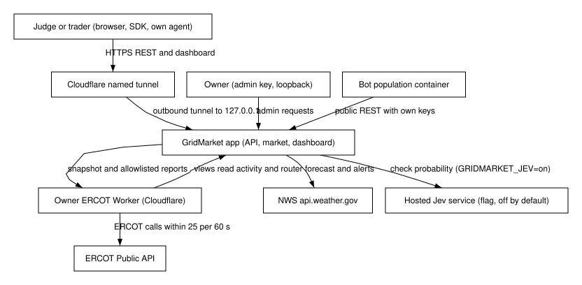

---
requirements:
  - AC-GM-DATA-04
  - AC-GM-OPS-01
---

#### System context

**BLUF:** GridMarket's boundary encloses the market app and its bot container, and every external party reaches it only through the tunnel, the host loopback, or the owner's ERCOT Worker.

**Frame**

- **Who:** Judges and traders, the owner, the bot population, the ERCOT Worker, ERCOT, NWS, and the optional hosted Jev service.
- **What:** The system boundary and every flow that crosses it.
- **Why:** To show that live ERCOT data enters only through the Worker and that the market is exposed only through an outbound tunnel.
- **How:** Docker Compose services bound to 127.0.0.1, an outbound Cloudflare named tunnel, and an HTTP client of the Worker.
- **When:** Whenever the stack runs; the tunnel is live from the Sunday recording through 15:00 CDT.
- **Where:** The spectre-dev workstation and the owner's Cloudflare account.

The market app is one FastAPI process that serves the REST API and the built
dashboard. The bot population runs in a second container and calls the same
public API over HTTP with its own keys. Judges and traders reach the app only
through an outbound Cloudflare named tunnel; the app binds its HTTP port to
127.0.0.1 on the host and runs as a non-root user (AC-GM-OPS-01). Admin
requests arrive only on the host loopback without a `CF-Connecting-IP`
header.

The market reads ERCOT signals only through the owner's ERCOT Worker, which
holds the ERCOT credentials, its 55-minute token cache, and the ERCOT
request budget. The market holds no ERCOT credential; it reads the Worker
URL and the market client key only from the untracked `.env` file, and never
writes them to the repository, to logs, or to API responses (AC-GM-DATA-04).
The Worker's 3D views read market activity and router results back from the
market by cross-origin GET. NWS weather data comes keyless from
`api.weather.gov`. The hosted Jev service is called only when the owner sets
`GRIDMARKET_JEV=on`.

Figure (F1): GridMarket system context

