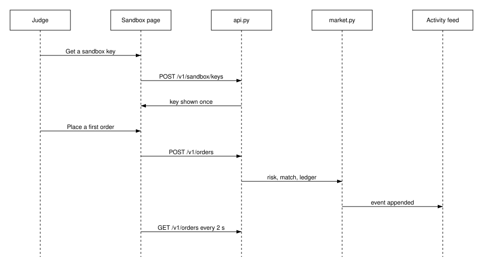

---
requirements:
  - AC-GM-API-04
  - AC-GM-UI-05
  - AC-GM-DOC-02
---

### Operational concept

**BLUF:** A judge goes from nothing to a visible order in two clicks and five seconds, and the same path works for a script or an agent following the user guide.

**Frame**

- **Who:** A judge or a user's agent new to GridMarket.
- **What:** The operational flow from first visit to first order.
- **Why:** The demo's commercial claim rests on onboarding being fast and safe.
- **How:** The Judge sandbox page calls `POST /v1/sandbox/keys`, then `POST /v1/orders`, then polls `GET /v1/orders`.
- **When:** On first visit; the page polls every 2 seconds.
- **Where:** The Judge sandbox route of the dashboard and the REST API behind the tunnel.

Click 1, "Get a sandbox key", creates a sandbox account with $1,000.00 and
shows the key once, kept only in page memory. Click 2, "Place a first order",
buys 1 credit of the next future product with that key. "Your orders" polls
with the key every 2 seconds and shows the order, labelled with the key
label, within 5 seconds of submission (AC-GM-UI-05). Copy buttons offer the
SDK snippet, the prompt kit, and the MCP snippet; a button whose file is not
served is hidden.

The same flow is available without the page: a Python example of at most 30
lines using the repository SDK and a sandbox key submits an order that the
activity feed shows within 5 seconds (AC-GM-API-04), and an agent that
follows only `docs/USER_GUIDE.md` obtains a key, reads market data, places an
order, and sees it among its own orders (AC-GM-DOC-02).

Figure (F5): Judge sandbox onboarding sequence

