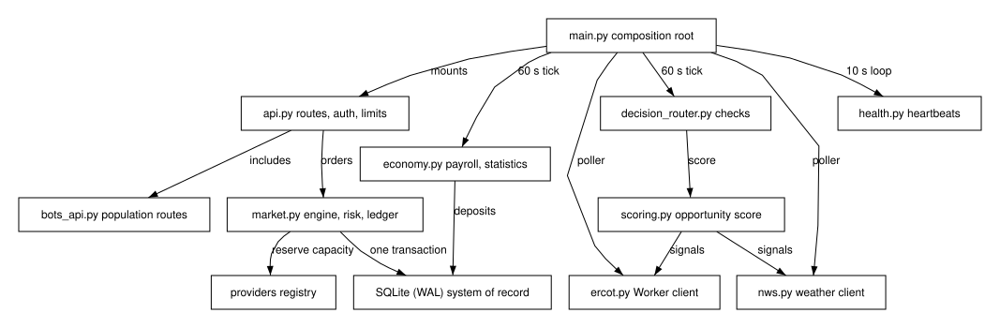

### 4.1 Feature Decomposition

**BLUF:** The app process decomposes into one module per feature, each owned by one lane, all composed in `main.py` and all persisting through one SQLite file.

**Frame**

- **Who:** Lane implementers and the Integration Engineer.
- **What:** The modules of the app process and their dependencies.
- **Why:** One owner per module keeps parallel lanes' write sets disjoint (AC-GM-LANE-01).
- **How:** `main.py` creates the DB, loads providers, selects the matching engine, starts pollers and ticks, and mounts routers.
- **When:** At process start (FastAPI lifespan).
- **Where:** `backend/gridmarket_server/`.

`main.py` is the composition root. It selects the matching engine by
`GRIDMARKET_ENGINE` (`python` by default, `rust` only when importable and
enabled), wires `scoring.predict` and the ERCOT signal store into the API,
starts the ERCOT Worker poller only when `GRIDMARKET_WORKER_URL` is set,
starts the NWS poller unless `GRIDMARKET_NWS=off`, starts the decision-router
tick (60 s), the payroll tick (60 s), and the provider heartbeat loop (10 s),
and serves `/llms.txt`, `/guide.md`, and `/kit/` only when those files exist.
It mounts the dashboard only when the static build exists. Sections 4.1.1
to 4.1.12 describe each feature.

Figure (F2): GridMarket app decomposition

