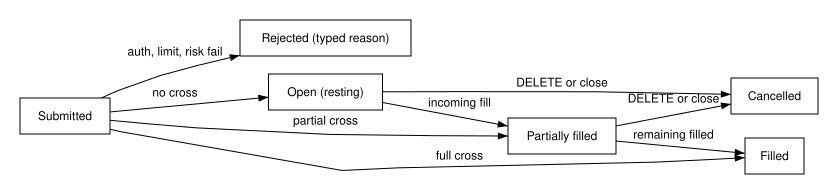

---
requirements:
  - AC-GM-MKT-01
  - AC-GM-MKT-02
  - AC-GM-MKT-03
  - AC-GM-MKT-04
  - AC-GM-MKT-06
---

#### 4.1.1 Market and risk engine

**BLUF:** Every order passes authentication, rate limit, idempotency, halt, and risk checks and is matched and booked in one `BEGIN IMMEDIATE` transaction, so no order sequence can break the ledger or over-reserve a battery.

**Frame**

- **Who:** Any client submitting an order: judges, bots, strategies, and agents.
- **What:** Product listing, order submission, the risk controls, and price-time matching (DES-GM-MARKET, DES-GM-RISK).
- **Why:** Market integrity: capacity and cash checks must not race.
- **How:** Serialized SQLite write transactions and a pure `MatchingEngine.match` function.
- **When:** Products listed every hour; orders on each `POST /v1/orders`.
- **Where:** `market.py` and `api.py`.

Every hour the settlement tick lists, per zone, spot products for delivery
hours 1–2 hours ahead and future products for 3–24 hours ahead, and closes
products whose delivery hour has started; both types trade through one
matching engine (AC-GM-MKT-01). The API also accepts the alias
`FLEX-<zone>-<HH>` for the next listed future product with hour-beginning
`HH` in America/Chicago. Canonical symbols are
`FLEX-<zone>-<YYYY-MM-DD>-<HH>` and `SPOT-<zone>-<YYYY-MM-DD>-<HH>`,
using the Central delivery date and start hour. The `delivery_hour` field
stores the corresponding UTC instant; expiry uses the end of that one-hour interval.
On fall-back, the first Central 01:00 keeps the plain symbol; the second
(standard time, UTC-06:00) appends `R`, for example
`FLEX-LZ_HOUSTON-2026-11-01-01R` (also applicable to `SPOT`).
These are separate products, books and settlements at 06:00Z and 07:00Z
on 2026-11-01. The hour alias selects the earliest open matching product
by UTC instant, advancing to the repeated hour once the first closes.

Order submission runs in one transaction: authenticate the key (401),
rate-limit per key (429), check the Idempotency-Key (400 missing, 409
different body, replay on identical body), check halts (423
`MARKET_HALTED`) and provider status (422 `PROVIDER_OFFLINE`), apply the risk
controls (422 with a typed reason), match, apply fills to the ledger, append
`trades` and `events`, store the idempotent response, and commit.

The risk controls are never cut. An order larger than 50 credits, an order
that would raise the absolute net position in a product above 200 credits,
or an order that needs more cash than cash minus holds of open orders is
rejected with a typed reason and changes no balance (AC-GM-MKT-04). Cash held
by an order is limit price × quantity for every buy and every future sell. A
spot sell instead reserves capacity per battery through
`ProviderAdapter.reserve_capacity` in the same transaction, never more than
state of charge minus minimum reserve minus existing reservations, so
concurrent sells cannot over-reserve (AC-GM-MKT-03).

The engine fills an incoming limit order in price-time priority at each
resting order's price, and each fill is recorded exactly once in the
append-only trade ledger, whose SQLite triggers abort any UPDATE or DELETE
(AC-GM-MKT-02). A spot fill moves price × quantity of simulated cash from
buyer to seller and adds the quantity to the buyer's Flex Credit inventory
(AC-GM-MKT-06). The figure shows the order states.

Figure (F7): Order state machine

Table (T3): Risk control limits

| Control | Limit | Rejection | Requirement |
|---|---|---|---|
| Maximum order size | 1 to 50 credits, integer | `ORDER_TOO_LARGE` | AC-GM-MKT-04 |
| Position limit | abs(net position per product) ≤ 200 | `POSITION_LIMIT` | AC-GM-MKT-04 |
| Cash hold | price × quantity for buys and future sells | `INSUFFICIENT_FUNDS` | AC-GM-MKT-04 |
| Capacity reservation | ≤ available capacity per battery and hour | `INSUFFICIENT_CAPACITY` | AC-GM-MKT-03 |
