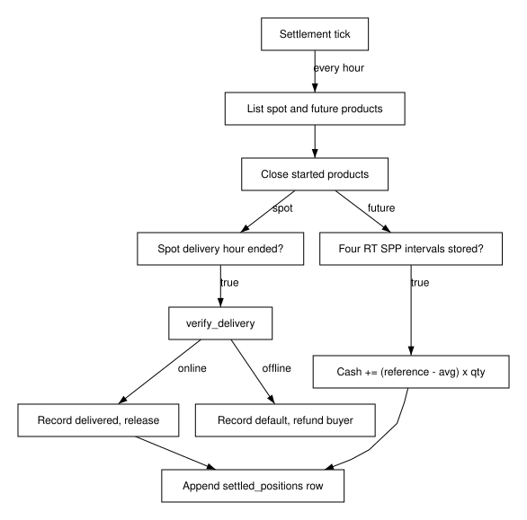

---
requirements:
  - AC-GM-MKT-05
  - AC-GM-ACCT-01
  - AC-GM-ECON-02
  - AC-GM-ECON-03
  - AC-GM-ECON-04
---

#### 4.1.2 Settlement, ledger, and bot economy

**BLUF:** Settlement is driven by stored ERCOT real-time prices and the ledger alone, so every balance, loss statistic, and bot state can be rebuilt after a restart.

**Frame**

- **Who:** Every account holder; bots through the payroll tick.
- **What:** Spot delivery, future expiry, settled positions, deposits, and startup seeding (DES-GM-SETTLE, DES-GM-ECON).
- **Why:** Market integrity and explainable P&L; deposits must never look like trading profit.
- **How:** Hourly settlement tick and 60-second payroll tick, each one transaction.
- **When:** At each delivery hour's end and each bot's pay time.
- **Where:** `market.py`, `economy.py`, and the `settled_positions` and `deposits` tables.

When a spot delivery hour ends, the tick calls `verify_delivery`; the
reservation is released and the commitment recorded as delivered, or as a
default with the buyer refunded when the provider reports the asset offline.
When all four 15-minute NP6-905-CD real-time prices of a future product's
delivery hour are stored, the reference price is their mean ÷ 1000 $/credit,
and each open position receives cash (reference − average price) × signed
quantity (AC-GM-MKT-05). There is no margin model, so an extreme price can
drive a short position's cash below zero; the dashboard shows it. Unrealized
P&L marks open futures at the last trade, else the mid, else the prediction's
expected value.

When the database is empty at startup, the system seeds the bot population
with starting cash, zero Flex Credits, one API key, and the sampled
batteries; human and judge sandbox accounts start with $1,000.00
(AC-GM-ACCT-01). Every 30 minutes, at a fixed per-bot offset, each employed
bot's pay is appended as a deposit, which is not a trade and changes no P&L
(AC-GM-ECON-02). A settled position with negative realized P&L counts as one
loss; a dormant bot gets no bailout (AC-GM-ECON-03). After a restart, every
bot's parameters, cash, positions, and dormant status equal the values rebuilt
from the ledger and the master seed (AC-GM-ECON-04).

Figure (F6): Settlement tick activity

