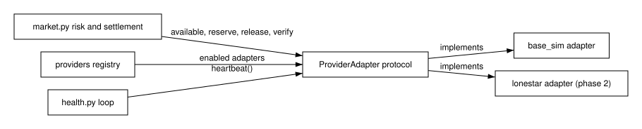

#### 4.2.1 Internal Interfaces

**BLUF:** In-process features talk through typed contracts, each a pure function or a protocol that takes the caller's transaction where atomicity matters.

**Frame**

- **Who:** Modules of the app process.
- **What:** The engine, provider, signal, router, prediction, and bot contracts.
- **Why:** Parallel lanes code against stubs of these contracts.
- **How:** Python protocols and dataclasses in `contracts.py`.
- **When:** Called on every order, tick, and prediction read.
- **Where:** `backend/gridmarket_server/`.

`MatchingEngine.match` is a pure function over resting orders sorted by best
price then earliest sequence; the Python and Rust engines satisfy one parity
suite. `ProviderAdapter` operations take the caller's open SQLite transaction
so reservation stays atomic with the order. The figure shows the provider
seam.

Figure (F3): Provider adapter interface

Table (T2): Internal interface signatures

| Interface | Producer | Consumer | Payload |
|---|---|---|---|
| `MatchingEngine.match(resting, incoming) -> MatchResult` | `market.py` or Rust core | Order path | Fills and remaining quantity (CONTRACT-GM-ENGINE) |
| `ProviderAdapter` protocol | `base_sim`, `lonestar` | `market.py`, `health.py` | Customers, assets, capacity, reservations, delivery, status, heartbeat (CONTRACT-GM-PROVIDER) |
| `SignalStore.latest`, `series`, `staleness` | `ercot.py`, `nws.py` | `scoring.py`, API | `Signal` rows and age (CONTRACT-GM-SIGNALS) |
| `decision_router.register(family, fn)` | Check families | Router tick | `CheckResult` rows (CONTRACT-GM-ROUTER) |
| `scoring.predict` | `scoring.py` | API, router, bots | `Prediction` records (CONTRACT-GM-PREDICTION) |
| `population.sample`, `economy.tick`, `economy.stats` | `population.py`, `economy.py` | Seeder, bots, API | `BotSpec` and statistics (CONTRACT-GM-BOTS) |
