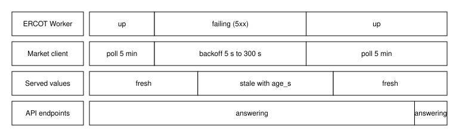

### 4.5 Fault Behavior

**BLUF:** GridMarket fails soft: data faults degrade to stale values, provider faults to typed rejections, and order faults to rejections that change no state.

**Frame**

- **Who:** Every feature under fault.
- **What:** Behavior when data sources, providers, or clients misbehave.
- **Why:** The demo must survive the faults it is likely to meet during recording.
- **How:** Backoff and stale marking, heartbeat-based offline marking, one-transaction rejections, and container restart.
- **When:** On any fault, until the source recovers.
- **Where:** Pollers, the router, the order path, and Compose.

ERCOT Worker or NWS failure triggers backoff from 5 s to 300 s while every
endpoint keeps answering from stored values marked stale with their age. A
provider whose heartbeat is older than 30 s is marked offline and its
customers' new sells are rejected until the next heartbeat. An asset offline
at delivery records a default and refunds the buyer. Every rejected order
changes no balance because the whole order path is one transaction. Rate
limits and the kill switch reject without side effects. If the process
crashes, Compose restarts it (`unless-stopped`) and state resumes from the
SQLite volume; bots rebuild from the ledger and master seed. The ML, backtest,
and qlib lanes never touch the live data path. The figure traces a Worker
outage from failure to recovery.

Figure (F8): ERCOT Worker outage and recovery

