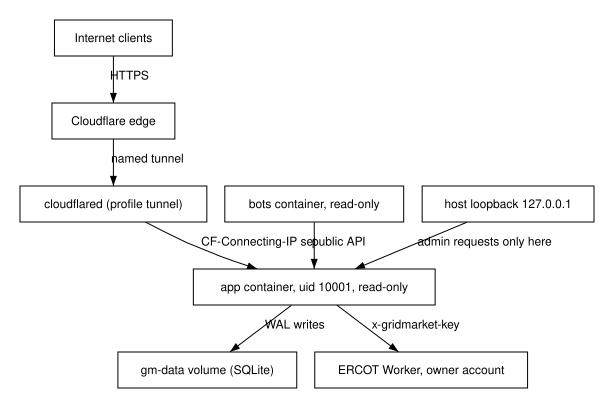

### Architecture views

**BLUF:** The deployment view shows every trust boundary: the internet reaches the app only through the tunnel, admin only through loopback, and ERCOT only through the Worker.

**Frame**

- **Who:** Reviewers checking security and operability.
- **What:** The deployment and trust-boundary view of the running system (DES-GM-OPS).
- **Why:** Operability and security lenses: the stack exposes itself only as intended.
- **How:** Docker Compose services `app`, `bots`, and `cloudflared`, non-root, read-only root filesystems.
- **When:** While the stack runs; the tunnel profile only during the demo window.
- **Where:** The spectre-dev host and Cloudflare.

The app image is multi-stage: a Node stage builds the dashboard and a Python
3.12-slim stage installs the backend with uv; it runs as uid 10001 with a
`HEALTHCHECK` on `/v1/market/status`. `app` binds
`127.0.0.1:${GRIDMARKET_PORT:-8000}`, uses a read-only root with tmpfs `/tmp`
and the `gm-data` volume. `bots` runs the same image read-only. `cloudflared`
runs only in the `tunnel` profile with the owner's credentials mounted
read-only from outside the repository. Isolation uses containers, not a VM:
non-root, read-only roots, no host mounts except the tunnel credentials, and
no inbound public port. The system context and app decomposition figures
complete the structural views.

Figure (F4): Deployment and trust boundaries

