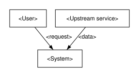

#### System context

**BLUF:** <One assertive sentence: the system boundary and the external entities across it.>

**Frame**

- **Who:** <The actor this section concerns.>
- **What:** <The subject or feature.>
- **Why:** <The intent.>
- **How:** <The mechanism.>
- **When:** <The time, phase, or trigger.>
- **Where:** <The location, component, or boundary.>

<Prose with no word limit: the system boundary and the external entities across it. Bind at most 5 requirements in the front
matter. Add one captioned table (T1-T8) when 3 or more items share 2 or more
attributes, and one captioned figure (F1-F8) when 3 or more entities have a
relationship, a time order, or states.>

Figure (F1): System context

